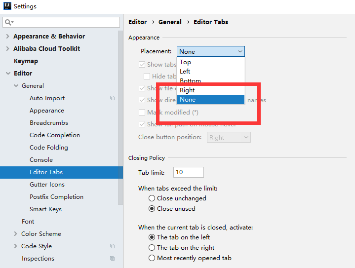
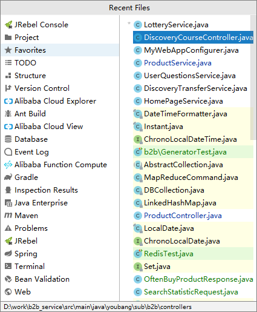
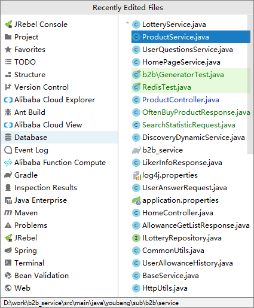
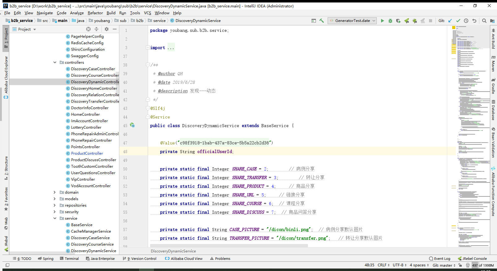

## 快捷键

### 1、关掉 Tab 页

### 2、最近访问文件（ctrl+e）

### 3、最近编辑的文件（ctrl+shift+e）

### 4、移动分割线

用 alt+1 来聚焦到 project 视图，再用 ctrl+shift+左右箭头 来移动分割线

### 5、书签

F11 用于添加书签，shift+F11 显示书签

### 6、在当前位置和刚才的位置切换

ctrl+alt+左箭头 回去

ctrl+alt+右箭头 前进

如果光标当前光标和之前的光标在不同的文件中，也会来回传递

### 7、多选光标

- 在相同的字符后进行多行编辑，alt+shift+鼠标左键选择
- ctrl+w 选中变量，alt+j 匹配之后的相同名称变量

### 8、重命名文件

shift+F6

- ctrl+w 按照语法层级向上选择代码，再+shift，反选
- ctrl+b 进入光标所在方法定义的地方或返回该方法被使用的地方

## 插件

### 1、CodeGlance

把代码小地图嵌入到编辑窗口

### 2、CamelCase

将不是驼峰格式的名称，快速转成驼峰格式，快捷键：shift+alt+u

### 3、Rainbow Brackets

彩虹颜色的括号