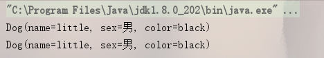
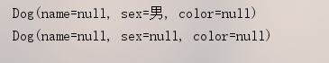
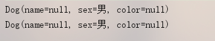

# @Builder 的使用、默认值设置、修改属性值

## 简单使用

@Builder 相比 @Getter、@Setter 优点有哪些呢 ？举例如下：

```java
package youbang.sub.b2berpapi;

import lombok.AllArgsConstructor;
import lombok.Builder;
import lombok.Data;
import lombok.NoArgsConstructor;

/**
 * @author QH
 * @date 2019/5/21
 * @description @Builder 测试
 */
public class BuildTest {

    public static void main(String[] args) {
        Dog dog1 = new Dog("little", "男", "black");
        Dog dog2 = Dog.builder().name("little").sex("男").color("black").build();
        System.out.println(dog1.toString());
        System.out.println(dog2.toString());
    }
}

@Data
@Builder
@NoArgsConstructor
@AllArgsConstructor
class Dog {
    private String name;

    private String sex;

    private String color;
}

```

运行结果：



## 属性默认值设置

原来的 model 属性 sex 是设置了默认值的：


```java
public static void main(String[] args) {
    Dog dog1 = new Dog();
    Dog dog2 = Dog.builder().build();
    System.out.println(dog1.toString());
    System.out.println(dog2.toString());
}
```

运行结果



@Builder 默认是不支持默认值设置的，在有默认值得属性上使用注解： @Builder.Default



## 修改属性值

在 model 上加上注解参数：@Builder(toBuilder = true)

```java
@Data
@Builder(toBuilder = true)
@NoArgsConstructor
@AllArgsConstructor
class Dog {
    private String name;

    @Builder.Default
    private String sex = "男";

    private String color;
}
```

使用得时候，通过toBuilder() 方法拿到builder

```java
public static void main(String[] args) {
    Dog dog1 = Dog.builder().name("little").sex("男").color("black").build();
    System.out.println(dog1.toString());
    Dog dog2 = dog1.toBuilder().sex("女").build();
    System.out.println(dog2.toString());
}
```

运行结果：

