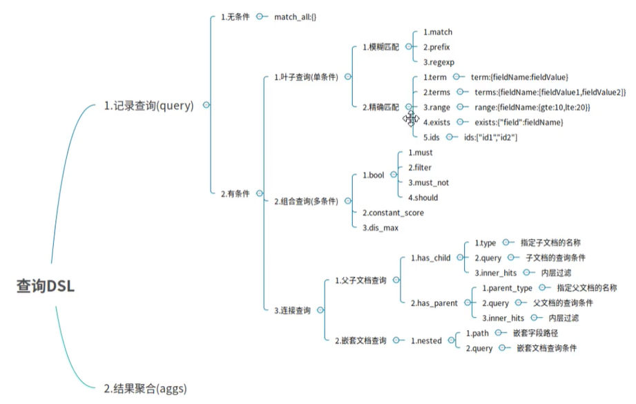

## 1、无查询条件

- match_all：无查询条件是查询所有，默认是查询所有的，或者使用 match_all 表示所有

```bash
GET /es_db/_search
{
	"query": {
		"match_all": {}
	}
}
```

## 2、有查询条件

### 2.1、叶子条件查询（单字段查询条件）

### 2.1.1、模糊匹配

> 模糊匹配主要是针对文本类型的字段，文本类型的字段会对内容进行分词，在查询时，也会对搜索条件进行分词，然后通过倒排索引查找到匹配的数据，模糊匹配主要通过 match 等参数来实现

- match：通过 match 关键字模糊匹配条件内容

  ```bash
  POST /es_db/_search
  {
    "query": {
      "match": {
        "address": "西湖"
      }
    }
  }
  ```

- prefix：前缀匹配

- regexp：通过正则表达式来匹配数据

match 的复杂用法：

- query：指定匹配的值
- operator：匹配条件类型
  - and：条件分词后都要匹配
  - or：条件分词后有一个匹配即可（默认）
- minmum_should_match：指定最小匹配的数量

#### 2.1.2、精确匹配

- trem：单个条件相等

  ```bash
  POST /es_db/_search
  {
    "query": {
      "term": {
        "name": {
          "value": "张三"
        }
      }
    }
  }
  
  # 输出
  {
    "took" : 1,
    "timed_out" : false,
    "_shards" : {
      "total" : 1,
      "successful" : 1,
      "skipped" : 0,
      "failed" : 0
    },
    "hits" : {
      "total" : {
        "value" : 1,
        "relation" : "eq"
      },
      "max_score" : 0.6931471,
      "hits" : [
        {
          "_index" : "es_db",
          "_type" : "_doc",
          "_id" : "1",
          "_score" : 0.6931471,
          "_source" : {
            "name" : "张三",
            "sex" : 0,
            "age" : 28,
            "address" : "杭州西湖区"
          }
        }
      ]
    }
  }
  ```

- terms：单个字段属于某个值数据内的值

- range：字段属于某个范围内的值

- exists：某个字段的值是否存在

- ids：通过ID批量查询

### 2.2、组合条件查询（多条件查询）

组合条件查询是将叶子条件查询语句进行组合而形成的一个完整的查询条件

- bool：各条件之间有 and、or 或 not 的关系
  - must：各个条件都必须满足，即各条件是 and 的关系
  - should：各个条件有一个满足即可，即各条件是 or 的关系
  - must_not：不满足所有条件，即各条件是 not 的关系
  - filter：不计算相关度评分，它不计算 _score，即相关度评分，效率更高
- constant_score：不计算相关度评分

must/filter/should/must_not 等的子条件是通过 term/terms/range/ids/exists/match 等叶子条件为参数的

> 注：以上参数，当只有一个搜索条件时，must 等对应的是一个对象，当是多个条件时，对应的是一个数组

### 2.3、连接查询（多文档合并查询）

- 父子文档查询：parent/child
- 嵌套文档查询：nested

[ElasticSearch架构原理与源码剖析全集（免费分享）_哔哩哔哩_bilibili](https://www.bilibili.com/video/BV1mb4y1z7U1?p=4)

22:15