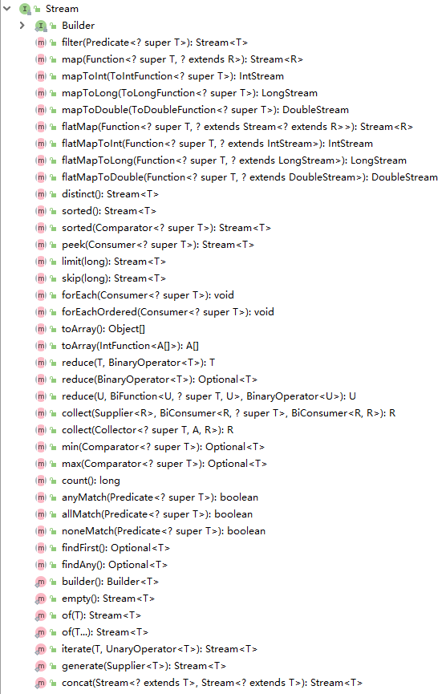

### Stream 类的类结构图



- 中间操作主要有以下方法（此类型方法返回的都是 Stream）：map（mapToInt、flatMap等），filter、distinct、sorted、peek、limit、skip、parallel、sequential、unordered
- 终止操作主要有以下方法：foreach、foreachOrdered、toArray、reduce、collect、min、max、count、anyMatch、allMatch、noneMatch、findFirst、findAny、iterator

### filter（筛选）

```java
// 筛选年龄大于15岁的学生
students.stream.filter(s -> s.getAge() > 15).collect(Collectors.toList());
// 筛选住在浙江省的学生
students.stream.filter(s -> "浙江".equals(s.getAddress)).collect(Collectors.toList());
```

### map（转换）

map 就是将对应的元素按照给定的方法进行转换。

```java
// 在地址前面加上部分信息，只获取地址输出
List<String> addresses = students.stream.map(s -> "地址:" + s.getAddress()).collect(Collectors.toList());
```

### distinct（去重）

```java
// 简单字符串去重
List<String> list = ...
list.stream().distinct();
```

### sorted（排序）

```java
// 简单集合
list.stream().sorted()
// 指定排序规则
students.stream().sorted((s1, s2) -> Long.compare(s1.getId(), s2.getId()))
    .sorted((s1, s2) -> Integer.compare(s1.getAge(), s2.getAge()))
```

