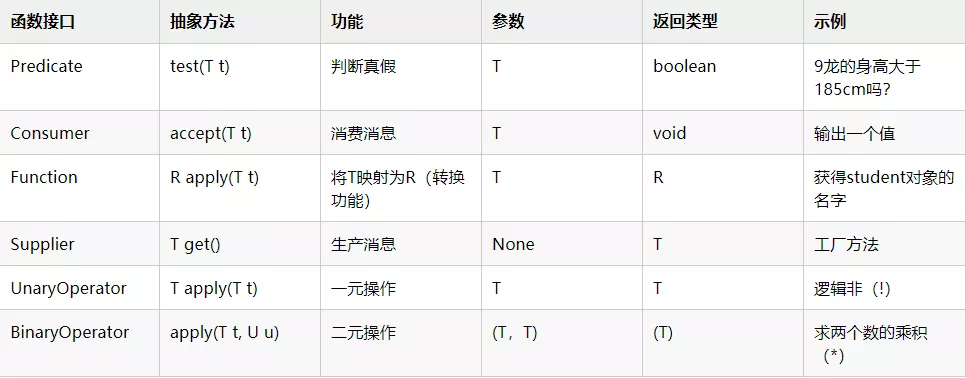

## 示例：

```java
public static void main(String[] args) {
    Predicate<Integer> predicate = x -> x > 185;
    Student student = new Studeng("9龙", 23, 175);
    System.out.println("9龙的身高大于185cm吗？" + predicate.test(sutdent.getStature()))；
        
    Consumer<String> consumer = System.out::printfln;
    consumer.accept("我命由我不由天");
    
    Function<Student, String> function = Student::getName;
    String name = function,apply(student);
    System.out.println(name);
    
    Supplier<Integer> supplier = () -> Integer.valueOf(BigDecimal.TEN.toString());
    System.out.println(supplier.get());
    
    UnaryOperator<Boolean> unaryOperator = uglily -> !uglily;
    Boolean apply = unaryOperator.apply(true);
    System.out.println(apply);
    
    BinaryOperator<Integer> operator = (x, y) -> x * y;
    Integer integer = operator.apply(2, 3);
    System.out.println(integer);
}
```

## Function<T, R> 

T：入参类型，R：出参类型

调用方法：R apply(T t); 

定义函数示例：Function<Integer, Integer> func = p -> p * 10;    // 输出入参的10倍

调用函数示例：func.apply(10);    // 结果100

## Consumer<T>

T：入参类型；没有出参

调用方法：void accept(T t);

定义函数示例：Consumer<String> consumer= p -> System.out.println(p);    // 因为没有出参，常用于打印、发送短信等消费动作

调用函数示例：consumer.accept("18800008888");

## Supplier<T>

T：出参类型；没有入参

调用方法：T get();

定义函数示例：Supplier<Integer> supplier= () -> 100;    // 常用于业务“有条件运行”时，符合条件再调用获取结果的应用场景；运行结果须提前定义，但不运行。

调用函数示例：supplier.get();

## Predicate<T>

T：入参类型；出参类型是Boolean

调用方法：boolean test(T t);

定义函数示例：Predicate<Integer> predicate = p -> p % 2 == 0;    // 判断是否、是不是偶数

调用函数示例：predicate.test(100);    // 运行结果true