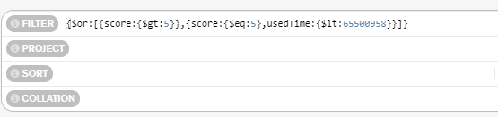

### 场景：求出 score 集合中，成绩比我好的记录

> 求出分数高的记录，如果分数相同，则找出用时较短的

#### 数据格式：

```sql
{
	_id:5d8aded69e72e120048b91aa
    userId:"1ec5b274-0619-48be-9c7b-19af1ec85070"
    score:8
    usedTime:6500955
    year:2019
    month:9
},
{
	_id:5d8adf489e72e127242abbc1
    userId:"d89cd206-4097-48d7-9c27-89e6d4b95f7a"
    score:5
    usedTime:5500958
    year:2019
    month:9
}
```

#### 用法：

```sql
{$or:[{score:{$gt:5}},{score:{$eq:5},usedTime:{$lt:65500958}}]}
```

```java
Query query = new Query();
Criteria criteria = new Criteria();
criteria.orOperator(Criteria.where("score").gt(5), Criteria.where("score").is(5).and("usedTime").lt(65500958));
query.addCriteria(criteria);
```

