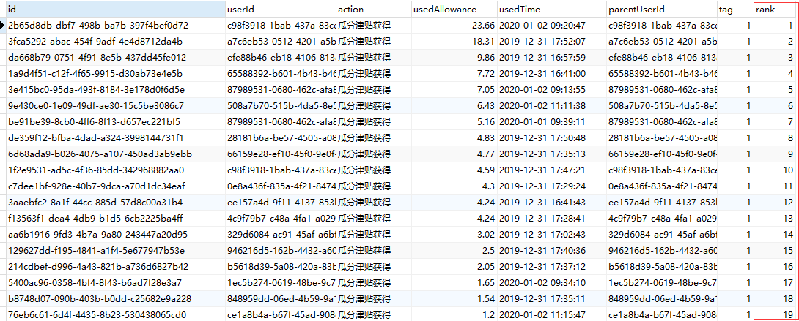
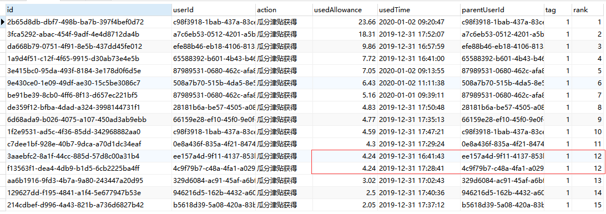

## 一、:= 与 = 的区别

​		`:=` 是赋值的意思。在 set、update、select 中表示赋值的意思，用的比较少一般都用 =，但是在用变量实现获取排列的行号时（本文），一定要用 `:=` 。

​		`=` 等于的意思。只有当 set、update 时，是和 `:=` 的意思是一样的，表示赋值，其余情况都是等于的意思。

## 二、用户变量 @

​		`@rank` 是对一个叫 rank 的参数进行赋值。对用户变量赋值有两种方式，一种直接用 `=` ，另一种用 `:=` 。其区别在于使用 set 命令对用户变量赋值时，两种方式都可以使用；当使用 select 语句对用户变量进行赋值时，只能使用 `:=` 方式，因为在 select 语句中，`=` 被看作是比较操作符。

## 三、根据某字段排序并获取排序号

```mysql
SELECT
	a.*,
	@rank := @rank + 1 AS rank 
FROM
	( SELECT * FROM user_allowance_history ORDER BY usedAllowance DESC ) a,
	( SELECT @rank := 0 ) b
```

​		这个 sql 的作用是查询用户获得的津贴，按从大到小排序，并返回序号。（当访问量相同的时候，按正常顺序，继续排序）。



其他的写法：

```mysql
set @rank=0;
SELECT
	a.*,
	@rank := @rank + 1 AS rank 
FROM
	( SELECT * FROM user_allowance_history ORDER BY usedAllowance DESC ) a
```

```mysql
SELECT
	a.id,
	a.usedAllowance,
	a.userId,
	@rank := @rank + 1 AS rank 
FROM
	( SELECT *,@rank:=0 FROM user_allowance_history ORDER BY usedAllowance DESC ) a

```

## 四、如果排序字段的值存在多个相同的记录，则相同值序号相同

```mysql
set @rank=0,@rowtotal:=null;
SELECT
	a.*,
	case when @rowtotal=a.usedAllowance then @rank
	when @rowtotal:=a.usedAllowance then @rank:=@rank+1 end as rank
FROM
	( SELECT * FROM user_allowance_history ORDER BY usedAllowance DESC ) a
```



参考：【 https://blog.csdn.net/gao763024185/article/details/79638052 】