## 运算符

### 1、算数运算符

- 加（+）：mysql> SELECT 1+1;
- 减（-）：mysql> SELECT 3-2;
- 乘（*）：mysql> SELECT 2*3;
- 除（/）：mysql> SELECT 5/3;
- 商（DIV）：mysql> SELECT 5 DIV 2;
- 模（%或MOD()）：mysql> SELECT 5%2 或 mysql> SELECT MOD(5,2);

### 2、比较运算符

- 等于（=）：mysql> SELECT 1=0;
- 不等于（!=或<>）：mysql> SELECT 1<>0;
- 安全等于（<=>）：mysql> SELECT 1<=>1;
- 小于（<）：mysql> SELECT ‘a’<’b’;
- 小于等于（<=）：mysql> SELECT ‘abc’<=’a’;
- 大于（>）：mysql> SELECT ‘a’>’b’;
- 大于等于（>=）：mysql> SELECT ‘a’>=’b’;
- BETWEEN：mysql> SELECT 10 between 10 and 20;
- IN：mysql> SELECT 1 in (1,2,3);
- IS NULL：mysql> SELECT 0 IS NULL;
- IS NOT NULL：mysql> SELECT 0 IS NOT NULL;
- LIKE：mysql> SELECT 123456 LIKE ‘123%’;
- REGEXP：mysql> SELECT ‘abcdef’ REGEXP ‘ab’;

### 3、逻辑运算符

- 非（NOT 或 !）： 
  mysql> SELECT NOT 0,NOT 1,NOT NULL; 
  mysql> SELECT !0, !1, !NULL;

- 与（AND 或 &&）： 
  mysql> SELECT (1 AND 1), (0 AND 1), (3 AND 1), (1 AND NULL); 
  mysql> SELECT (1 && 1), (0 && 1), (3 && 1), (1 && NULL);

- 或（OR或 ||）： 
  mysql> SELECT (1 OR 0), (0 OR 0), (1 OR NULL), (1 OR 1), (NULL OR NULL); 
  mysql> SELECT (1 || 0), (0 || 0), (1 || NULL), (1 || 1), (NULL || NULL);

- 异或（XOR 或 ^）： 
  mysql> SELECT (1 XOR 1), (0 XOR 0), (1 XOR 0), (0 XOR 1), (NULL XOR 1); 
  mysql> SELECT (1 ^ 1), (0 ^ 0), (1 ^ 0), (0 ^ 1), (NULL ^ 1);

### 4、位运算符

- 位与（&）： 
  mysql> SELECT 2&3; 
  mysql> SELECT 2&3&4;

- 位或（|） 
  mysql> SELECT 2|3;

- 位异或（^） 
  mysql> SELECT 2^3;

- 位取反（~） 
  mysql> SELECT ~1,~18446744073709551614;

- 位右移（>>） 
  mysql> SELECT 100>>3;

- 位左移（<<） 
  mysql> SELECT 100<<3;

### 5、运算符优先级顺序

最高优先级：= 
1. ||, OR, XOR 
2. &&, AND 
3. BETWEEN, CASE, WHEN, THEN, ELSE 
4. =, <=>, >=, >, <=, <, <>, !=, IS, LIKE, REGEXP, IN 
5. | 
6. & 
7. <<, >> 
8. -, + 
9. *, /, DIV, %, MOD 
10. ^ 
11. - (unary minus), ~ (unary bit inversion) 
12. !, NOT 
    最低优先级：BINARY, COLLATE

## 字符函数

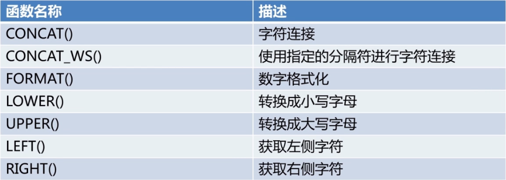

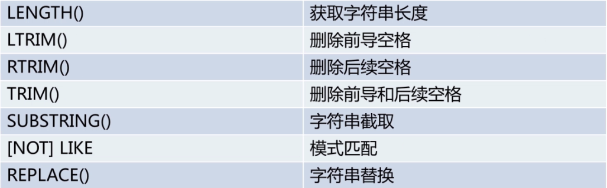

示例：

- SUBSTRING()

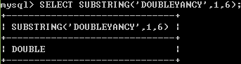

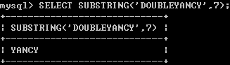

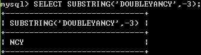

>  说明：在程序上，字符串的编号从0开始，但在MySQL中，从1开始。

- [Not] like

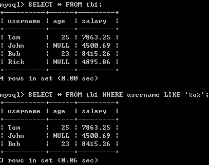

> 说明：%（百分号）：任意个字符；_（下划线）：任意一个字符。

## 数值运算符函数

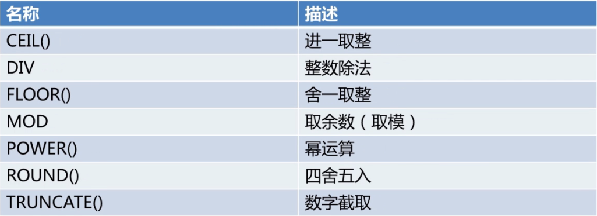

## 比较运算符函数

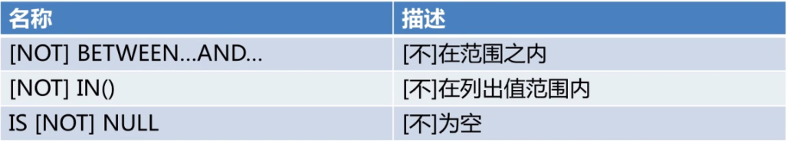

## 日期时间函数

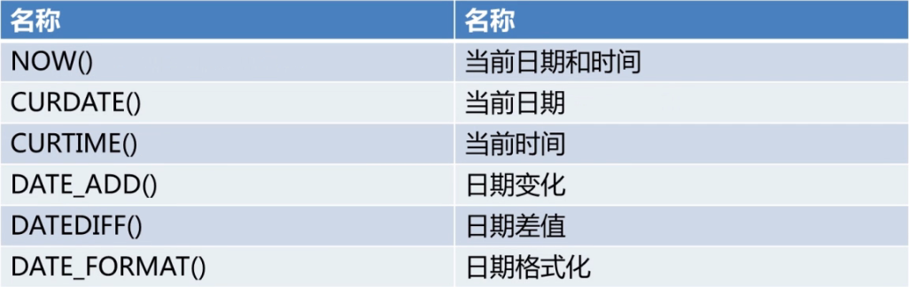

## 信息函数

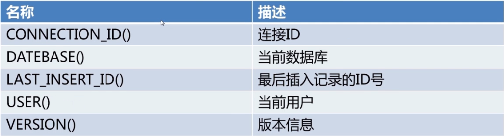

## 聚合函数

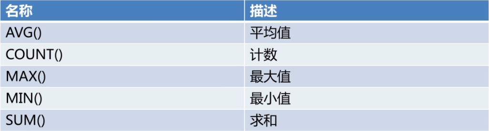

## 加密函数

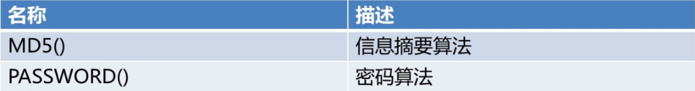