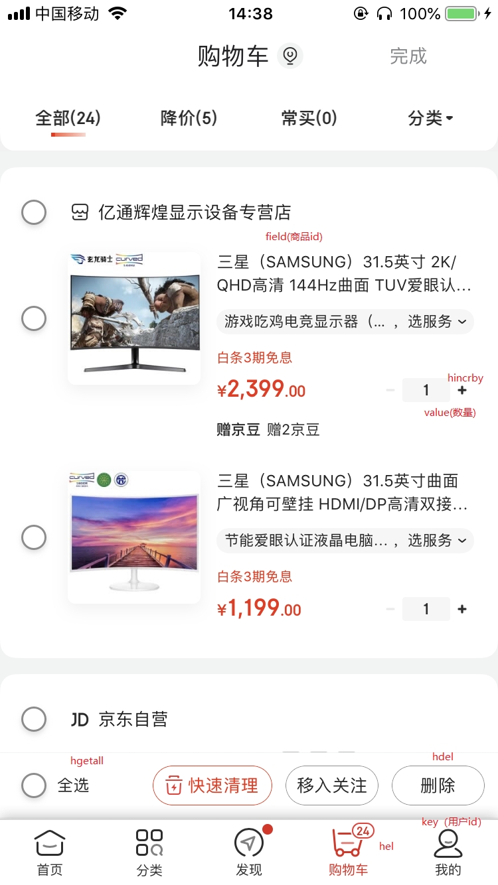

## Hash常用操作

```sql
HSET key field value	// 将哈希表key中的字段field的值设置为value
HSETNX key field value	// 只有在字段field不存在时，设置哈希表字段的值
HMSET key field1 value1 [field2 value2 ] 	// 同时将多个field-value（域-值）存储到哈希表key中
HGET key field		// 获取哈希表中key对应的field的值
HMGET key field1 [field2]		// 获取所有给定的值
HDEL key field [field ...]		// 删除一个或多个哈希表字段
HLEN key	// 获取哈希表key中field的数量
HGETALL key		// 获取在哈希表中指定key的所有字段和值
HINCRBY key field increment		// 为哈希表key中field键的值加上增量increment
```

## 电商购物车：

1. 以用户id为key
2. 商品id为field
3. 商品数量为value

## 购物车操作：

```sql
1.添加商品 - HSET cart:1001 10008 1		// 在用户1001的购物车中添加了1件编号为10008的商品
2.增加数量 - HINCRBY cart:1001 10008 1	// 往用户1001的购物车中增加了1件编号为10008的商品
3.商品总数 - HLEN cart:1001		// 获取用户1001购物车里的商品总数
4.删除商品 - HDEL cart:1001 10008	// 删除用户1001购物车里的编号为10008的商品
5.获取购物车所有商品 - HGETALL cart:1001
```

## 举例：

```sql
> HSET cart:1001 10008 1
(integer) 1
> HSET cart:1001 10008 1
(integer) 0
> Hincrby cart:1001 10008 1
(integer) 2
> Hincrby cart:1001 10008 1
(integer) 3
> HSET cart:1001 10009 2
(integer) 1
> hlen cart:1001
2
> hget cart:1001 10008
"3"
> hget cart:1001 10009
"2"
> hgetall cart:1001
1) "10008"
2) "3"
3) "10009"
4) "2"
```

## Hash 结构优缺点：

- 优点：
  - 同类数据归类整合存储，方便数据管理
  - 相比 string 操作消耗内存与 cpu 更小
  - 相比 string 存储更节省空间
- 缺点：
  - 过期功能不能使用在 field 上，只能使用在 key 上
  - Redis 集群架构下不适合大规模使用（redis 分片是根据key进行分片的，会导致大量的数据堆积、过于集中）