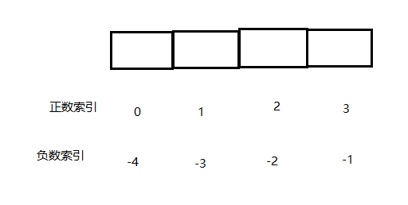

### 索引



## list 常用操作：

```sql
LPUSH key value [value ...] 	// 将一个或多个值value插入到key列表的表头（最左边）
RPUSH key value[value ...]		// 将一个或多个值value插入到key列表的表尾（最右边）
LPOP key	// 移除并返回key列表的头元素
RPOP key	// 移除并返回key列表的尾元素
LRANGE key start stop	// 返回列表key中指定区间内的元素，区间以偏移量start和stop指定
BLPOP key [key ...] timeout	// 从key列表表头弹出一个元素，若列表中没有元素，阻塞等待timeout秒，如果timeout=0，一直阻塞等待
BRPOP key [key ...] timeout	// 从key列表表尾弹出一个元素，若列表中没有元素，阻塞等待timeout秒，如果timeout=0，一直阻塞等待
```

## 常用数据结构：

```sql
Stack（栈） = LPUSH + LPOP -> FIFO
QUEUE（队列） = LPUSH + RPOP
Blocking MQ（阻塞队列） = LPUSH + BRPOP
```

## 应用场景：

### 微博和微信公众号消息流：

```sql
我的id为1026，我关注了周杰伦，汪峰等歌手
1.周杰伦发了一条微博，消息id为10012
LPUSH msg:1026 10012
2.汪峰发了一条微博，消息id为10013
LPUSH msg:1026 10013
3.查看5条最新的微博消息
LRANGE msg:1026 0 4
```

