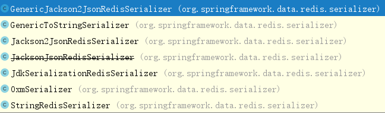
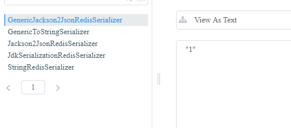
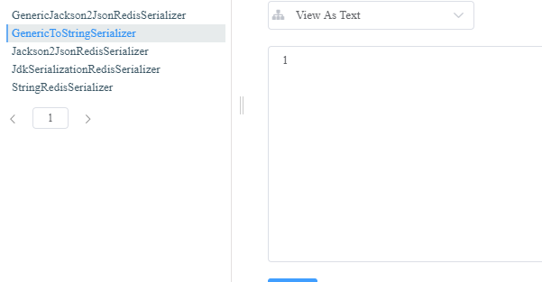
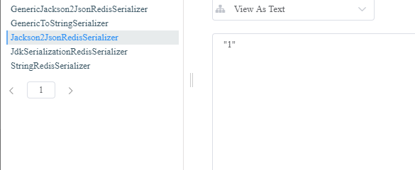
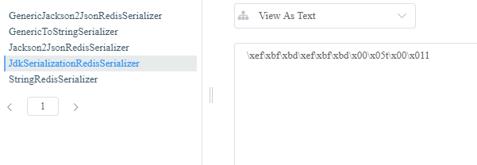
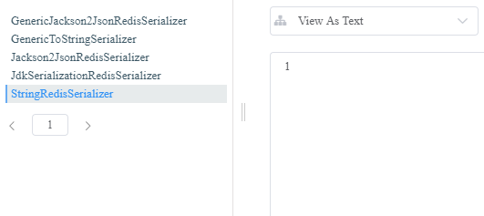
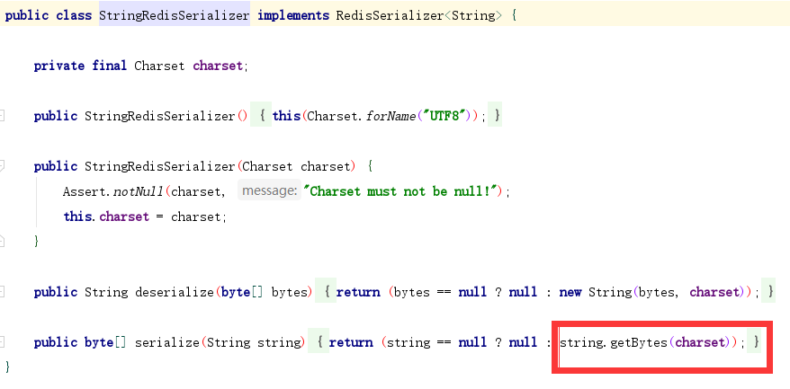
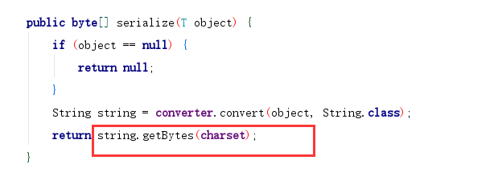

> 场景：使用 redisTemplate 记录抽奖次数，每抽一次 +1，在保存 {“game:23312380”:1} 时报错，并且无法进行 incr 操作

## 序列化器

​		序列化器的作用是将 key 或者 value 序列化为流，存储到 redis。首先看一下 RedisSerializer 接口：


一个序列化接口，一个反序列化接口。具体实现有以下几种：



各序列化器的测试：

```java
@Test
public void testSerializer() {
    JedisConnectionFactory factory = (JedisConnectionFactory) redisTemplate.getConnectionFactory();
    factory.setDatabase(9);
    redisTemplate.setConnectionFactory(factory);


    ValueOperations ops = redisTemplate.opsForValue();

    redisTemplate.setValueSerializer(new StringRedisSerializer());
    ops.set("StringRedisSerializer", "1");

    redisTemplate.setValueSerializer(new GenericToStringSerializer<>(String.class));
    ops.set("GenericToStringSerializer", "1");

    redisTemplate.setValueSerializer(new GenericJackson2JsonRedisSerializer());
    ops.set("GenericJackson2JsonRedisSerializer", "1");

    redisTemplate.setValueSerializer(new Jackson2JsonRedisSerializer<>(String.class));
    ops.set("Jackson2JsonRedisSerializer", "1");

    redisTemplate.setValueSerializer(new JdkSerializationRedisSerializer());
    ops.set("JdkSerializationRedisSerializer", "1");
}
```











## 总结：

- **GenericJackson2JsonRedisSerializer、Jackson2JsonRedisSerializer**是先将对象转为json，然后再保存到redis，所以，1在redis中是字符串1，所以无法进行加1 

-  **JdkSerializationRedisSerializer**使用的jdk对象序列化，序列化后的值有类信息、版本号等，所以是一个包含很多字母的字符串，所以根本无法加1 

-  **GenericToStringSerializer、StringRedisSerializer**将字符串的值直接转为字节数组，所以保存到redis中是数字，所以可以进行加1 

## 源码分析

StringRedisSerializer 源码：



GenericToStringSerializer 源码：



两种序列化器都是直接获取的字节数组，因此存到 redis 中，可以使用 incr 方法。

> incr 命令将 key 中存储的数字值加 1，如果 key 不存在，那么 key 的值会先被初始化为 0，然后再执行 incr 操作，且将 key 的有效时间设置为长期有效。