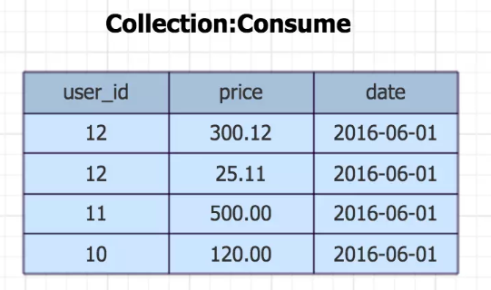
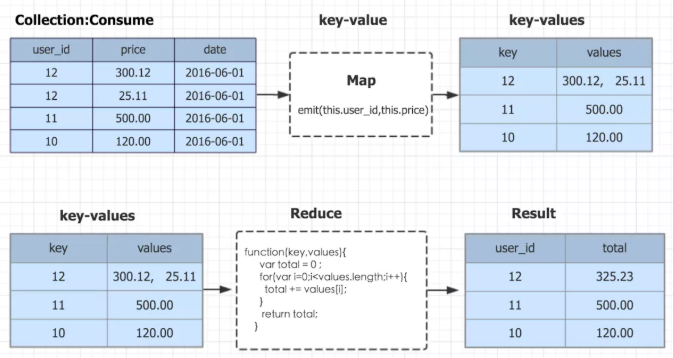

命令方式：

```java
db.collection.mapReduce(
    map,    //map函数（生成键值对序列,作为 reduce 函数参数）
    reduce, //reduce函数
    {
        <out>,    //存放输出结果的集合，不写使用临时集合
        <query>, //筛选条件，符合条件才会进入map
        <sort>,   //排序
        <limit>,  //限制条数
        <finalize>, 
        <scope>, 
        <jsMode>, 
        <verbose>
    }
)
```

举例：



计算每个用户 2016-06-01 这天的消费金额

```java
db.consume.mapReduce(
    function(){ emit( this.user_id,this.price ) },
    function(key,values){ 
      var total = 0 ;
      for(var i=0;i<values.length;i++){
        total += values[i];
      }
       return total;
    },//end reduce function
    {
        query:{"date":"2016-06-01"}
    }
)
```

> 上文中的例子主要逻辑是，将集合中的文档按user_id分组，得到以user_id为key的数组，形成key－values的映射关系，再将key－values的映射关系做为参数，放入reduce函数，reduce函数，迭代values数组，将values数据内的消费金额叠加，返回total总值；



- 将consume集合内的数据按照每天每个客户汇总金额

```jsx
var mapfunction = function(){
    emit( {this.date, this.user_id}，this.price} )
}

var reducefunction = function(key,values){ 
      var total = 0 ;
      for(var i=0;i<values.length;i++){
        total += values[i];
      }
      return total;
 }

db.consume.mapReduce(
    mapfunction,
    reducefunction
)
```

其他的示例：

```java
 book = new BasicDBObject();  
   book.put("name", "Understanding Axis2");  
   book.put("pages", 150);  
   books.insert(book);  
     
   String map = "function() { "+   
             "var category; " +    
             "if ( this.pages >= 250 ) "+    
             "category = 'Big Books'; " +  
             "else " +  
             "category = 'Small Books'; "+    
             "emit(category, {name: this.name});}";  
     
   String reduce = "function(key, values) { " +  
                            "var sum = 0; " +  
                            "values.forEach(function(doc) { " +  
                            "sum += 1; "+  
                            "}); " +  
                            "return {books: sum};} "; 
结果显示：
{ "_id" : "Big Books", "value" : { "books" : 2 } } 
{ "_id" : "Small Books", "value" : { "books" : 3 } } 
```

```java
db.order.mapReduce{
    function() {emit(this.logname, 1);},
    function(key, values) {
        var ret = {"name":key,"count":Array.sum(values)};
        return ret;
    }
    {
        query:{uploadTime:{$gt:1231234124}},
        out:{inline:1}	// 在内存中存储记录（数据量少的情况下）
    }
}
结果
[
    {
        "_id":"log-123123",
        "value":{
            "name":"log-123123",
            "count":5.0
        }
    },
    {
        "_id":"log-123154",
        "value":{
            "name":"log-123154",
            "count":9.0
        }
    }
]
```


```java
public static void main(String[] args) {  
  
  Mongo mongo;  
    
  try {  
   mongo = new Mongo("localhost", 27017);  
   DB db = mongo.getDB("library");  
  
   DBCollection books = db.getCollection("books");  
  
   BasicDBObject book = new BasicDBObject();  
   book.put("name", "Understanding JAVA");  
   book.put("pages", 100);  
   books.insert(book);  
     
   book = new BasicDBObject();    
   book.put("name", "Understanding JSON");  
   book.put("pages", 200);  
   books.insert(book);  
     
   book = new BasicDBObject();  
   book.put("name", "Understanding XML");  
   book.put("pages", 300);  
   books.insert(book);  
     
   book = new BasicDBObject();  
   book.put("name", "Understanding Web Services");  
   book.put("pages", 400);  
   books.insert(book);  
   
   book = new BasicDBObject();  
   book.put("name", "Understanding Axis2");  
   book.put("pages", 150);  
   books.insert(book);  
     
   String map = "function() { "+   
             "var category; " +    
             "if ( this.pages >= 250 ) "+    
             "category = 'Big Books'; " +  
             "else " +  
             "category = 'Small Books'; "+    
             "emit(category, {name: this.name});}";  
     
   String reduce = "function(key, values) { " +  
                            "var sum = 0; " +  
                            "values.forEach(function(doc) { " +  
                            "sum += 1; "+  
                            "}); " +  
                            "return {books: sum};} ";  
     
   MapReduceCommand cmd = new MapReduceCommand(books, map, reduce,  
     null, MapReduceCommand.OutputType.INLINE, null);  
  
   MapReduceOutput out = books.mapReduce(cmd);  
  
   for (DBObject o : out.results()) {  
    System.out.println(o.toString());  
   }  
  } catch (Exception e) {  
   // TODO Auto-generated catch block  
   e.printStackTrace();  
  }  
 }  
}  
```

```java

String mapper = "function() {" +
        "emit(this.categoryId,1);" +
        "}";
String reducer = "function(key,values){" +
        "return Array.sum(values);" +
        "}";
collection.mapReduce(mapper, reducer)
        .databaseName("test")   //结果保存在”test“数据库中，默认为当前数据库
        .collectionName("result") //指定结果保存的collection，默认为inline模式，不保存，直接通过cursor输出
        .action(MapReduceAction.REPLACE) //结果保存方式，如果”result“表存在，则替换。
        .nonAtomic(false) //是否为”非原子性“
        .sharded(false) //结果collection是否为sharded
        .maxTime(180,TimeUnit.SECONDS) //mapreduce执行的最大时间
        .iterator() //触发执行，这句话千万别忘了，否则不会执行
        .close(); //我们不需要cursor，则直接关闭
//此后即可通过result collection获取数据统计的结果

https://blog.csdn.net/iteye_19607/article/details/82644559
```


参考：

[1]: https://www.cnblogs.com/shaosks/p/5684906.html
[2]: https://blog.csdn.net/java_ee/article/details/24845017	"MongoDB MapReduce Java"
[3]: https://blog.csdn.net/xusheng__zhang/article/details/78472167	"Map Reduce 详解"
[4]: https://blog.csdn.net/chunyuan314/article/details/63686341	"涉及时间ISODate"

