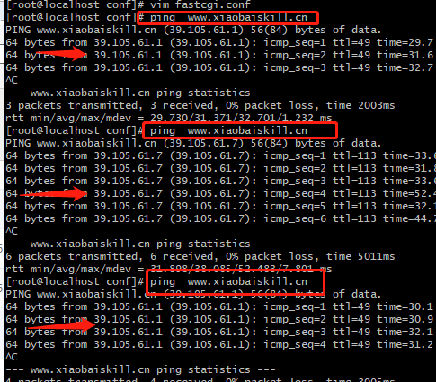
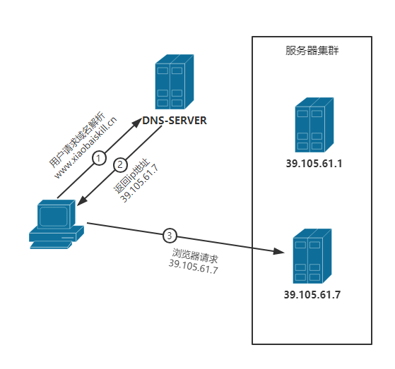

## 域名解析多 ip 示例

**dns 解析时多添加几个不同IP的A记录**

上图中我给域名解析到两个不同的ip,大概等十分钟后我们ping 一下的结果如下

## 负载均衡之 DNS 解析原理图

每次域名请求时DNS会根据负载均衡算法返回不同的ip地址。

## 负载均衡 DNS 解析之优缺点

优点：

1. 配置简单，无成本费用
2. 将负载均衡的工作交给了DNS服务器，省去了管理的麻烦

 　缺点：

1. 记录的添加与修改是需要一定时间才能够生效的(因为DNS缓存了A记录)。一旦有一台服务器坏了需要下线，即使修改了A记录，要使其生效也需要较长的时间，这段时间，DNS任然会将域名解析到已下线的服务器上，最终导致用户访问失败。
2. 不能按需分配负载，DNS并不知道各服务器的真实负载情况，所以负载效果不是很好

　实际的情况：

　　　　 在实际的项目部署，我们一般会将部分服务器使用DNS解析，利用域名解析作为第一级负载均衡.再在服务器中使用 NGINX 负载均衡作为第二级负载均衡。