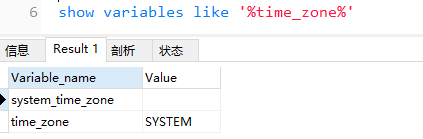
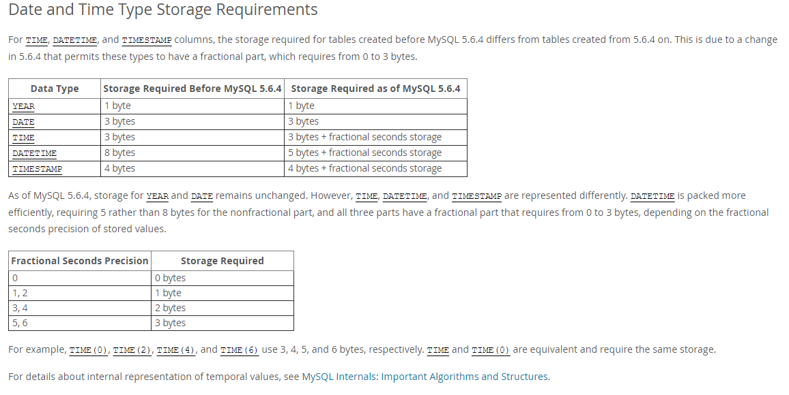
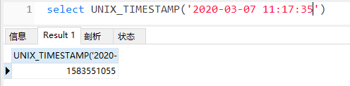
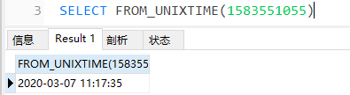
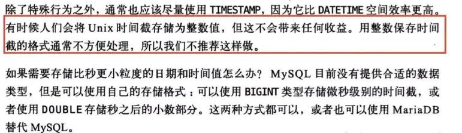
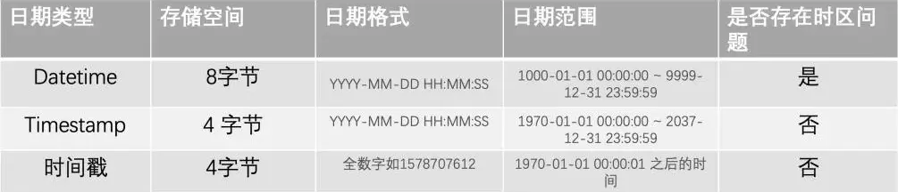

> 平时开发中不可避免的就是要存储时间，比如操作一条记录的时间、开始时间、结束时间等等。

## Mysql 时区

- 查看当前 Mysql 设置的时区信息

  ```shell
  show variables like '%time_zone%'
  
  # 查看当前会话时区
  SELECT @@session.time_zone
  
  # 查看全局时区
  SELECT @@global.time_zone
  ```

  
  - value 为 SYSTEM 的含义是：Mysql 使用当前操作系统的时区 

- 修改时区信息

  ```shell
  # 将 Mysql 的全局时区修改为东8区，即北京时间
  set global time_zone = '+8:00'
  
  set GLOBAL time_zone = 'Europe/Helsinki'
  ```

  ```shell
  # 将 Mysql 的当前会话时区修改为东8区，即北京时间
  set time_zone = '+8:00'
  ```

  ```shell
  # 或者修改 mysql 安装目录下的配置文件 my.ini 
  default-time-zone='Hongkong'
  ```

  - 使设置立即生效

    ```shell
    flush privileges;
    ```

## DateTime 和 Timestamp 如何抉择

- DateTime 类型是没有时区信息的。DateTime 类型保存的时间都是**当前会话所设置的时区**对应的时间。这样会有什么问题呢？当你的时区更换之后，比如服务器更换地址或者更换客户端连接时区设置的话，就会导致你从数据库中读出的时间错误。
- Timestamp 和时区有关。Timestamp 类型字段的值会随着服务器时区的变化而变化，自动换算成相应的时间，说简单点就是在不同的时区，查询到同一条记录的字段的值会不一样。

- DateTime 类型耗费空间更大。TImestamp 只需要使用 4 个字节的存储空间，但是 DateTime 需要耗费 8 个字节的存储空间。但是，这样同样造成了一个问题，Timestamp 表示的空间范围更小。
  - DateTime：1000-01-01 00:00:00 ~ 9999-12-31 23:59:59
  - Timestamp:  1970-01-01 00:00:00 ~ 2037-12-31 23:59:59 （timestamp 在不同版本的 Mysql 有细微差别）

## Mysql 日期类型所占的存储空间

[MYSQL 5.6 官方文档]( https://dev.mysql.com/doc/refman/5.6/en/storage-requirements.html#data-types-storage-reqs-date-time )



​	-- 可以看出 5.6.4 之后的 Mysql 多出了一个需要 0-3 bytes 的小数位。DateTime 和 Timestamp 会有几种不同的存储空间占用。

## 补充：

​	很多时候，我们也会使用 int 或者 bigint 类型的数值也就是时间戳来表示时间。

​	这种存储方式具有 Timestamp 类型的一些优点，并且使用它进行日期排序以及对比等操作的效率会更高，跨系统也很方便，毕竟只是存放的数值。缺点也很明显，就是数据可读性差，无法直观的看到具体时间。

时间戳的定义如下：

- 时间戳的定义是从一个基准时间开始算起，这个基准时间是「1970-1-1 00:00:00 +0:00」，从这个时间开始，用整数表示，以秒计时，随着时间的流逝这个时间整数不断增加。这样一来，我只需要一个数值，就可以完美地表示时间了，而且这个数值是一个绝对数值，即无论的身处地球的任何角落，这个表示时间的时间戳，都是一样的，生成的数值都是一样的，并且没有时区的概念，所以在系统的中时间的传输中，都不需要进行额外的转换了，只有在显示给用户的时候，才转换为字符串格式的本地时间。





## 总结

Mysql 中时间到底怎么存储才好？DateTime？Timestamp？数值保存的时间戳？

好像并没有一个银弹，很多程序员会觉得数值型时间戳是真的好，效率又高还各种兼容，但是很多人又觉得它表现的不够直观。这里插一嘴，《高性能 MySQL 》这本神书的作者就是推荐 Timestamp，原因是数值表示时间不够直观。下面是原文：



 每种方式都有各自的优势，根据实际场景才是王道。下面再对这三种方式做一个简单的对比，以供大家实际开发中选择正确的存放时间的数据类型： 



