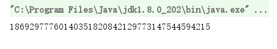
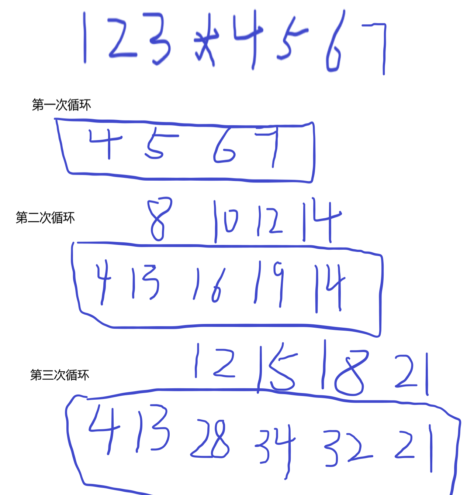

> 题目：请使用代码计算：1234567891011121314151617181920 * 2119181716151413121110987654321

### 理解两个大数相乘过程：

1. 明确程序是一个通用法则。这个实现过程既可以满足以为数字相乘，也可以满足两位数字相乘。既然满足一位数字、两位数字，那么自然满足多为数字相乘。
2. 无法使用任何编程语言的基本数据类型去表示这样一个大数，自然也不能够满足这个数的乘积了。这也是这个面试题的难点。

**思想**：将输入的字符串，转成char数组，转成int数组。采用分治思想，每一位的相乘。

**公式**：AB*CD  =  AC (BC+ AD) BD,然后   从后到前满十进位。


**套用公式**

67*89 = 6*8（7*8 + 6*9）7*9  

67*89 = 48（110）63


**从后到前满十进位**

63进6剩余3，

110变成116，满十进位，进行11，剩余6，

48变成59。所以： 5963

### 实现过程

```java
public void cal() {
    String num1 = "123456789101112131415";
    String num2 = "151413121110987654321";
    // 把字符串转成char数组
    char[] chars1 = num1.toCharArray();
    char[] chars2 = num2.toCharArray();
    // 声明存放结果和
    int[] result = new int[chars1.length + chars2.length];
    int[] n1 = new int[chars1.length];
    int[] n2 = new int[chars2.length];

    // 把char转换成int数组
    for (int i = 0; i < chars1.length; i++) {
        n1[i] = chars1[i] - '0';
    }
    for (int j = 0; j < chars2.length; j++) {
        n2[j] = chars2[j] - '0';
    }

    // 逐个相乘
    for (int i = 0; i < chars1.length; i++) {
        for (int j = 0; j < chars2.length; j++) {
            //                System.out.println(n1[i]);
            //                System.out.println(n2[j]);
            result[i + j] += n1[i] * n2[j];
            //                System.out.println(result[i+j]);
        }
    }

    // 从后往前，满十进位
    for (int i = result.length - 1; i > 0 ; i--) {
        result[i - 1] += result[i] / 10;
        result[i] = result[i] % 10;
    }

    // 转成String并返回
    String resultStr = "";
    for (int i = 0; i < result.length - 1; i++) {
        resultStr += "" + result[i];
    }

    System.out.println(resultStr);
}
```



### 关键点：

1. 一个数乘以一个数的结果长度必定小于或者等于这个两个数长度之和。
2. 把char字符转成int型，需要这个字符减去字符0.字符和数字在内存里都是以ASCII形式存储的。
3. 逐个相乘。（其实也是数组中根据index的对应位上进行相加累积）
4. 从后往前满十进位。一个操作。

> 关键：
>
> ​	哪个位是进位并且作相加累积。
>
> ​        哪个位是保存余下的数字。

### 图解循环过程：



### 从后往前满十进位：

```tex
21，进2，剩下1；
32+2为34，进3，剩下4；
34+3为37，进行3，剩下7；
28+3为31，进3，剩下1；
13+3为16，进1，剩下6；
4+1为5。所以：561741。
```

