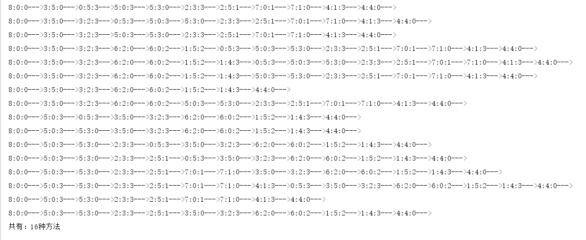

> 题目：有三个容积分别为3,5,8升的水桶，其中容积为8升的水桶中装了水，容积为3,5的水桶为空。水桶没有刻度尺，现在需要将水桶中的8升水等分成2分，每份都是4升水，该怎么分。总共有多少种分方法

### 思路

1. 水桶分别为3、5、8L，而且没有刻度衡量倒多少水，所有倒水要么把被倒的水桶倒满，要么把倒水的桶倒完。
2. 我们可以给每一个桶标记一种状态，初始状态就是8L水桶满，其余两个水桶为空，每倒一次，两个桶的状态会改变，动态递归算法，把每一种水桶可以倒的情况都尝试一遍，直到满足两个4L的水为止，但是，这样有可能会出现重复的情况，比如8L水桶倒向3L水桶，3L水桶又倒回8L水桶，这样状态就重复了，永远倒不玩，所以，我们把每步走的状态都放到栈中，如果出现重复状态，立即结束当前倒水。

### 代码实现

```java
package com.seven.level2;

import java.util.ArrayList;
import java.util.List;

/**
 * @author QH
 * @date 2019/10/14
 * @description 倒水问题
 */
public class PourWater {

    /**
     * 有三个容积分别为3、5、8升的水桶，其中容积为8升的水桶中装了水，容积为3、5的水桶为空
     * 水桶没有刻度尺，现在需要将水桶中的8升水等分成2份，每份都是4升水，该怎么分？
     * 共有多少种分法
     */
    // 定义水桶规则
    private static final int[] rule = {8, 5, 3};
    // 记录有多少种方法
    private static int num = 0;

    static class Action{
        // 定义属性并初始化
        int[] bucket = {8, 0, 0};
        List<int[]> rout = new ArrayList<>();   // 每一次的分水结果

        @Override
        public String toString() {
            return "["+bucket[0]+bucket[1]+bucket[2]+"]";
        }
    }

    // 倒水
    private static void pour(int from, int to, Action action) {
        // 分两种，多倒少，少倒多
        /**
         * action.bucket[from] >= remain -》 action.bucket[from] >= rule[to] - action.bucket[to] -》
         * action.bucket[from] + action.bucket[to] >= rule[to]
         * 8:0:0 -> 3:5:0  <==>  8+0 >= 5
         */
        int remain = rule[to] - action.bucket[to];  // 倒了多少水
        if (action.bucket[from] >= remain) {    // 多倒少的情况
            action.bucket[from] -= remain;
            action.bucket[to] = rule[to];   // 每次倒水要不就是倒完自己，要不就是把对方装满
        } else {    // 少倒多的情况
            action.bucket[to] += action.bucket[from];
            action.bucket[from] = 0;
        }
    }

    // 判断是否能倒水
    private static boolean canPour(int from, int to, Action action) {
        /**
         * to水桶满：false
         * from水桶空：false
         * from水桶水+to水桶水>to水桶水：false
         * from=to即自己倒自己，不能倒：false
         */
        if (from == to) return false;
        if (action.bucket[from] == 0) return false;
        if (action.bucket[to] == rule[to]) return false;
//        if (action.bucket[from] + action.bucket[to] > rule[to]) return false;
        return true;
    }

    // 创建临时对象，存储倒水前action对象 source -> target
    private static void copy(Action source, Action target) {
        for (int i = 0; i < source.bucket.length; i++) {
            target.bucket[i] = source.bucket[i];
        }
        for (int[] r : source.rout) {
            int[] t = new int[3];
            for (int i = 0; i < r.length; i++) {
                t[i] = r[i];
            }
            target.rout.add(t);
        }
    }

    // 判断两数组值是否相等
    private static boolean isEquals(int[] a1, int[] a2) {
        if (a1.length != a2.length) {
            return false;
        }
        for (int i = 0; i < a2.length; i++) {
            if (a1[i] != a2[i]) return false;
        }
        return true;
    }


    // 倒水情况
    private static void function(Action action) {
        // 当回路时退出
        for (int[] r :
                action.rout) {
            if (isEquals(r, action.bucket)) return;
        }
        // 添加新路径
        {
            int[] t = new int[3];
            for (int i = 0; i < action.bucket.length; i++) {
                t[i] = action.bucket[i];
            }
            action.rout.add(t);
        }
        // 当平分时结束
        if (action.bucket[0] == 4 && action.bucket[1] == 4) {
            for (int[] r : action.rout) {
                System.out.print(r[0]+":"+r[1]+":"+r[2]+"--->");
            }
            System.out.println();
            num++;
            return;
        }

        // 6种倒法
        if (canPour(0, 1, action)) {    // 1倒2
            Action tem = new Action();
            copy(action, tem);
            // 倒水
            pour(0, 1, action);
            function(action);
            action = tem;
        }
        if (canPour(0, 2, action)) {    // 1倒3
            Action tem = new Action();
            copy(action, tem);
            // 倒水
            pour(0, 2, action);
            function(action);
            action = tem;
        }
        if (canPour(1, 0, action)) {    // 2倒1
            Action tem = new Action();
            copy(action, tem);
            // 倒水
            pour(1, 0, action);
            function(action);
            action = tem;
        }
        if (canPour(1, 2, action)) {    // 2倒3
            Action tem = new Action();
            copy(action, tem);
            // 倒水
            pour(1, 2, action);
            function(action);
            action = tem;
        }
        if (canPour(2, 0, action)) {    // 3倒1
            Action tem = new Action();
            copy(action, tem);
            // 倒水
            pour(2, 0, action);
            function(action);
            action = tem;
        }
        if (canPour(2, 1, action)) {    // 3倒2
            Action tem = new Action();
            copy(action, tem);
            // 倒水
            pour(2, 1, action);
            function(action);
            action = tem;
        }
    }

    public static void main(String[] args) {
        Action a = new Action();
        function(a);
        System.out.println("共有：" + num + "种方法");
    }
}

```

### 运行结果：



