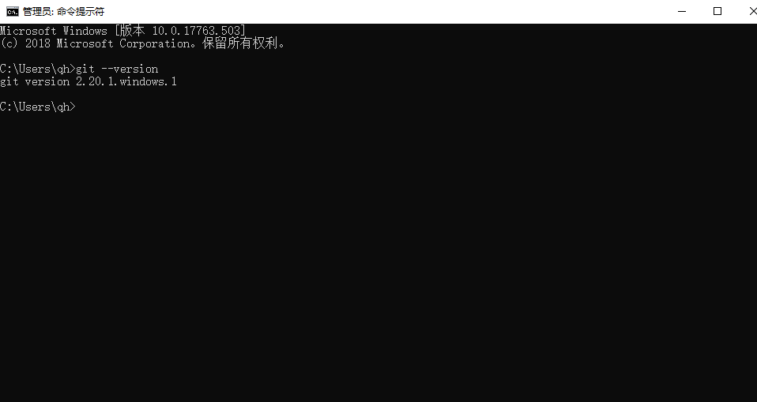

## 下载

下载地址：https://git-scm.com/downloads

## 安装

双击安装文件，然后出现安装向导界面,点击下一步(Next)即可

接着出现授权信息界面， Next即可

选择安装路径

选择文件关联,如果你不清楚,直接默认,下一步即可

接着出现开始菜单文件夹,默认,下一步即可

然后是是否配置Path的配置,选择中间一个,可以通过 Windows命令行(CMD)调用 git 命令。 然后点击下一步

选择回车换行的格式。默认即可.(检出时转换为Windows风格,提交时转换为Linux风格.)

然后是安装进度界面

安装完成. 去掉那个查看版本说明的复选框,点击完成(Finish)按钮即可

可以在cmd里面测试是否设置了Path,是否安装成功. 在CMD中输入 git 或者 git --version 试试

