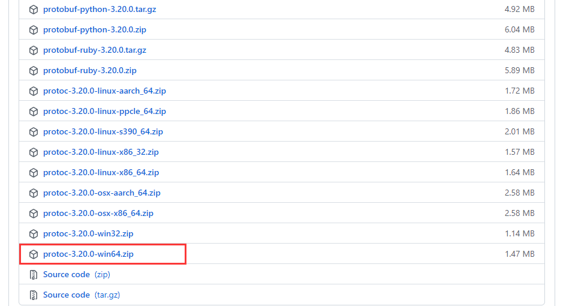

[grpc GitHub 地址](https://github.com/grpc/grpc-go)

1. 首先创建一个空目录，并初始化 module

```
go mod init
```

2. 安装 grpc 的依赖

```
$ go get -u google.golang.org/grpc
```

## Protobuf

[protobuf Github 地址](https://github.com/protocolbuffers/protobuf)

[golang protobuf GitHub 地址](https://github.com/golang/protobuf)

[官网](https://developers.google.cn/protocol-buffers)

下载 release 包进行安装

https://github.com/protocolbuffers/protobuf/releases



### 安装编译器

下载上面zip包后，解压，并把bin目录路径放到环境变量中

### 安装插件 protoc-gen-go

protoc-gen-go is a plugin for the Google protocol buffer compiler to generate Go code

[包管理地址](https://pkg.go.dev/github.com/golang/protobuf/protoc-gen-go)

```
go install github.com/golang/protobuf/protoc-gen-go
```

此时会在 GOPATH 的 bin 目录下生成可执行文件 .protobuf 的编译器插件 protoc-gen-go，之后执行 protoc 命令时会自动调用这个插件

proto 文件：

```
syntax="proto3";
package v1;
option go_package="./";

message ProdRequest {
  int32 prod_id=1;
}

message ProdResponse {
  int32 prod_stock=1;
}

service ProdService {
  rpc GetProdStock(ProdRequest) returns (ProdResponse);
}
```

生成中间文件命令：

```
protoc --proto_path=. --go_out=plugins=grpc:. *.proto
```

