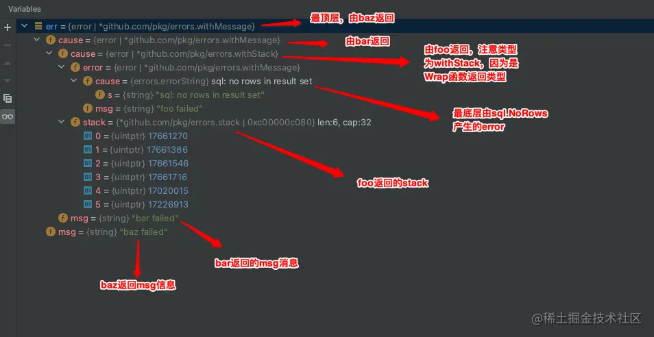

在进行后台开发的时候，错误处理是每个程序员都会遇到的问题，`golang`官方提供的错误处理包`error`似乎并不那么智能和好用，那么如何优雅地处理和记录代码中的错误信息呢？本文将会从以下几个角度来探索`error`处理的方式。

## golang中的error

`golang`中的`error`只是简单的接口，任何实现了`Error()`方法的`struct`都可以用来处理错误信息。

```go
// The error built-in interface type is the conventional interface for
// representing an error condition, with the nil value representing no error.
type error interface {
	Error() string
}
```

假设一个程序员在`Model`层进行开发时，某个函数的功能为简单的向数据库索要数据，他可能会写下以下代码

```go
func SomeFunc(id int) (Result, error) {
	result, err := Find(id)
	if err != nil {
                // 没有找到数据，向log里面写入一条消息，方便以后进行问题定位
		log.Info("some err in Find..., err: %v", err)
                // 然后将错误进行返回
		return Result{}, err
	}
	return result, nil
}
```

然后下一个程序员在`Service`层进行开发时，某个函数的功能为调用`SomeFun()`然后对`Result`进行处理，所以他可能会写下以下代码

```go
func ServiceFun(id int) bool {
	result, err := SomeFunc(id)
	if err != nil {
                // SomeFun执行出错，向log里面写入一条消息，方便以后进行问题定位
		log.Info("some err in SomeFun..., err: %v", err)
		return false
	}
	// do sth to handle result
}
```

现在就会出现一个很明显的问题了，同样一个`error`，却在日志里面打印了两次，有人说打印了两次就两次，无所谓，这样能够轻松快速地定位到问题所在。的确是这样，但是在一个大型后台系统中，如果许多代码都是以这种方式来记录日志的话，那么就会导致日志文件很大，并且很多信息都是重复的，这并不满足本文标题-`优雅的处理error`。

按照一般开发的原则，日志记录会放在`Service`层，其下的`Model`层只需要将`error`返回即可，所以`log.Info("some err in Find..., err: %v", err)`是可以去除的，直接返回`err`即可，但是`golang`的`error`是没有调用栈的，如果`SomeFun`函数中出现的多句`return Result{}, err`的语句，在问题的定位上就比较棘手了。

## 使用github.com/pkg/error来处理错误

使用这个库可以很方便的打印出程序的调用栈。先来看一段程序

```go
func foo() error {
	return errors.Wrap(sql.ErrNoRows, "foo failed")
}

func bar() error {
	err := foo()
	return errors.WithMessage(err, "bar failed")
}

func baz() error {
	err := bar()
	return errors.WithMessage(err, "baz failed")
}

fun main() {
    err := baz()
    fmt.Printf("data not found, %v\n", err)    // 标记①
    fmt.Printf("data not found, %+v\n", err)   /// 标记②
}
```

来看一下输出结果

```bash
### 下面这一行是标记①打印的内容
data not found, baz failed: bar failed: foo failed: sql: no rows in result set

### 下面这些内容是标记②打印的内容
sql: no rows in result set
foo failed
main.foo
        /path/to/main.go:24
main.bar
        /path/to/main.go:30
main.baz
        /path/to/main.go:35
main.main
        /path/to/main.go:65
runtime.main
        /usr/local/Cellar/go@1.15/1.15.11/libexec/src/runtime/proc.go:204
runtime.goexit
        /usr/local/Cellar/go@1.15/1.15.11/libexec/src/runtime/asm_amd64.s:1374
bar failed
baz failed
```

上面结果可以看出是`%v`的方式可以打印出调用链上所有用户自定义的错误信息，使用`%+v`的方式就可以打印出完整的调用栈，这个功劳主要归功于`Wrap`函数与`WithMessage`函数，我们来看一下源码

```go
// Wrapf returns an error annotating err with a stack trace
// at the point Wrapf is called, and the format specifier.
// If err is nil, Wrapf returns nil.
func Wrapf(err error, format string, args ...interface{}) error {
	if err == nil {
		return nil
	}
	err = &withMessage{
		cause: err,
		msg:   fmt.Sprintf(format, args...),
	}
	return &withStack{
		err,
		callers(),
	}
}

// WithMessage annotates err with a new message.
// If err is nil, WithMessage returns nil.
func WithMessage(err error, message string) error {
	if err == nil {
		return nil
	}
	return &withMessage{
		cause: err,
		msg:   message,
	}
}

type withMessage struct {
	cause error
	msg   string
}

type withStack struct {
	error
	*stack
}
```

可以看到`Wrap`的功能为返回一个能够用来标记错误堆栈的错误，`WithMessage`的功能为返回一个用`message`标记的错误，具体到函数可以看到`Wrap`返回的是一个`withStack`结构，而`WithMessage`返回是一个`withMessage`结构，`withStack`结构中包含了一个`*stack`，用`callers()`进行返回，错误堆栈信息就包含在这里。

回到`main`函数中，我们可以将`err := baz()`的`err`进行展开详细看一下他的结构




现在就很好理解`%v`和`%+v`输出的内容了。

需要注意的是，`Wrap`函数最好在调用的最底层使用，并且只使用一次，其他层的`error`可以只用`WithMessage`简单的添加一个上下文信息即可，如果每一层都使用`Wrap`那么会造成每出现一个`Wrap`，在最顶层使用`%+v`的方式打印日志时就会多打印一次调用栈，除非这些栈都是必要信息，不然会造成大量日志累积，为维护带来不便。

## 更进一步

虽然看到详细的调用堆栈对错误的定位很方便，但是过多的堆栈信息打印仍然会对日志系统带来很大的负担，有些时候对问题的定位其实往往不需要详细的调用栈，只需要一条调用链即可，比如

```
main.mian()@line: err ==> main.a()@line: err ==> b.b()@line: err ==> c.c()@line: err ... ==> fun()@line: some err
```

于是我们可以再对`github.com/pkg/error`进行一层封装，每次调用`Wrap`和`WithMessage`的时候跟上调用的函数名以及行数即可

```go
package MyError

import (
	"github.com/pkg/errors"
	"runtime"
	"strconv"
)

/**
 * @Author: chapaofan
 * @Date: 2021/5/15 2:08 下午
 */

func Wrap(err error, message string) error {
	return errors.Wrap(err, "==> "+printCallerNameAndLine()+message)
}

func WithMessage(err error, message string) error {
	return errors.WithMessage(err, "==> "+printCallerNameAndLine()+message)
}

func printCallerNameAndLine() string {
	pc, _, line, _ := runtime.Caller(2)
	return runtime.FuncForPC(pc).Name() + "()@" + strconv.Itoa(line) + ": "
}
```

这个时候再去执行`main`函数，就可以得到完整的调用链，而且又避免了复杂的调用堆栈

```bash
data not found, ==> main.baz()@39: baz failed: ==> main.bar()@33: bar failed: ==> main.foo()@24: foo failed: sql: no rows in result set
```