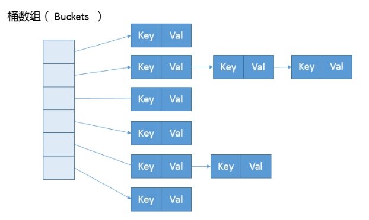
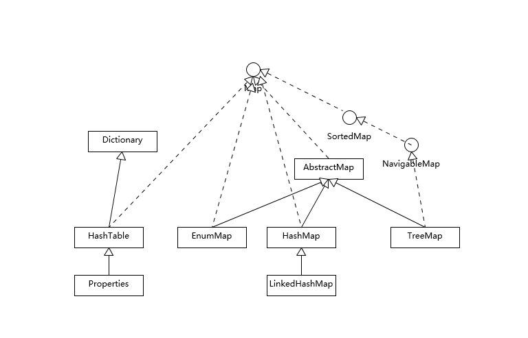
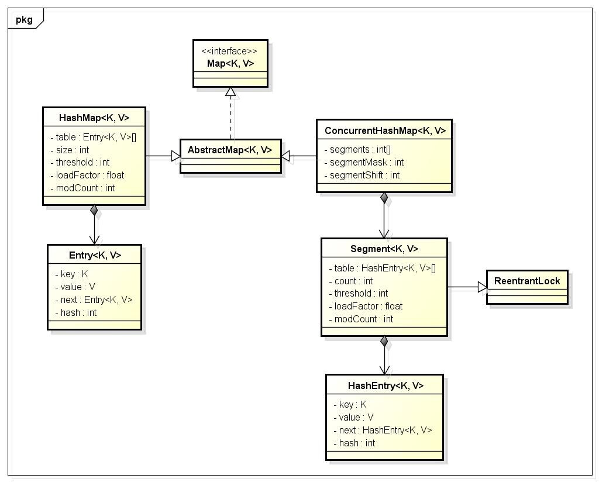

> 1. HashTable、HashMap、ConsurrentHashMap 的区别
> 2. HashMap 线程不安全的出现场景
> 3. HashMap put 方法存放数据时是怎么判断是否重复的
> 4. JDK 7 和 JDK 8 中 HashMap 的实现有什么区别
> 5. HashMap 的长度为什么是2的幂次方

### 三者区别

#### HashTable

- 底层数组+链表实现，无论 key 还是 value 都不能为 null，线程安全，实现线程安全的方式是在修改数据时锁住整个 HashTable，效率低，ConcurrentHashMap 做了相关优化
- 初始 size 为11，扩容：newSize = oldSize*2 + 1
- 计算index的方法：index=（hash&0x7FFFFFFF）%tab.length

#### HashMap

- 底层数组+链表实现，可以存储null键和null值，线程不安全

- 初始size为16，扩容：newSize=oldSize*2，size一定为2的n次幂

- 扩容针对整个 Map，每次扩容时，原来数组中的元素依次重新计算存放位置，并重新插入

- 插入元素后才判断该不该扩容，有可能无效扩容（插入后如果扩容，如果没有再次插入，就会产生无效扩容）

- 当 Map 中元素总数超过 Entry 数组的 75%，触发扩容操作，为了减少链表长度，元素分配更均匀

- 计算 index 方法：index=hash&（tab.length - 1）

  ```text
  HashMap 初始值还要考虑加载因子：参考：随笔/阿里推荐：集合初始化时，指定集合容量大小
  哈希冲突：若干 key 的哈希值按数组大小取模后，如果落在同一个数组下标上，将组成一条 Entry 链，对 key 的查找需要遍历 Entry 链上的每个元素执行 equals() 比较。
  加载因子：为了降低哈希冲突的概率，默认当 HashMap 中的键值对达到数组大小的 75% 时，即会触发扩容。因此，如果预估容量是 100，即需要设定 100/0.75 = 134 的数组大小。
  空间换时间：如果希望加快 key 查找的时间，还可以进一步降低加载因子，加大初始大小，以降低哈希冲突的概率。
  ```

HashMap 的内部结构可以看作是数组(Node<K,V>[] table)和链表的复合结构，数组被分为一个个桶（bucket），通过哈希值决定了键值对在这个数组中的寻址（哈希值相同的键值对，则以链表形式存储），如下图所示。有一点需要注意，**如果链表大小超过阈值（TREEIFY_THRESHOLD,8），图中的链表就会被改造为树形结构**。

> 为什么是 8？
>
> 当桶中链表元素超过8时，会自动转换成红黑树；若桶中元素小于等于6时，树结构还原成链表形式
>
> 1、红黑树的平均查找长度是log(n)，而链表的平均查找长度是n/2，当长度为8时，链表平均查找长度为4，树的平均查找长度为3，这才有转换成树的必要；链表长度如果小于等于6，链表的平均查找长度为3，树的平均查找长度为2.6，但是转化为树结构和生成树的时间并不会太短。
>
> - 选择6和8的原因
>
>   中间有一个7可以防止链表和树之间频繁转换。假设一个 HashMap 不停的插入删除元素，链表个数在8左右徘徊，就会频繁的发生树转链表、链表转树，效率会很低
>
> 2、由源码中的频率表可以看出，桶的长度超过 8 的概率非常非常小。（more: less than 1 in ten million）



HashMap和Hashtable都是用hash算法来决定其元素的存储，因此HashMap和Hashtable的hash表包含如下属性：

- 容量（capacity）：hash表中桶的数量
- 初始化容量（initial capacity）：创建hash表时桶的数量，HashMap允许在构造器中指定初始化容量
- 尺寸（size）：当前hash表中记录的数量
- 负载因子（load factor）：负载因子等于“size/capacity”。负载因子为0，表示空的hash表，0.5表示半满的散列表，依此类推。轻负载的散列表具有冲突少、适宜插入与查询的特点（但是使用Iterator迭代元素时比较慢）

除此之外，hash表里还有一个“负载极限”，“负载极限”是一个0～1的数值，“负载极限”决定了hash表的最大填满程度。当hash表中的负载因子达到指定的“负载极限”时，hash表会自动成倍地增加容量（桶的数量），并将原有的对象重新分配，放入新的桶内，这称为rehashing。

HashMap和Hashtable的构造器允许指定一个负载极限，HashMap和Hashtable默认的“负载极限”为0.75，这表明当该hash表的3/4已经被填满时，hash表会发生rehashing。

“负载极限”的默认值（0.75）是时间和空间成本上的一种折中：

- 较高的“负载极限”可以降低hash表所占用的内存空间，但会增加查询数据的时间开销，而查询是最频繁的操作（HashMap的get()与put()方法都要用到查询）
- 较低的“负载极限”会提高查询数据的性能，但会增加hash表所占用的内存开销

程序猿可以根据实际情况来调整“负载极限”值，但一般不建议轻易修改，因为JDK自身的默认负载因子是非常符合通用场景需求的。如果确实需要修改，建议不要设置超过0.75，因为会显著增加冲突，降低HashMap的性能。

根据容量和负载因子的关系，我们可以预先设置合适的容量大小，具体数值我们可以根据扩容发生的条件来做简单预估，计算公式如下：

```java
 负载因子 * 容量 > 元素数量
```

#### ConcurrentHashMap

- 底层采用分段的数组+链表实现，线程安全。
- key 和 value 都不能为null，由于HashMap 的干扰，很多人都认为 ConcurrentHashMap 是可以置入 null 值。同理，Set 中的 value 实际上是 Map 中的 key。
- 通过把整个 Map 分为 N 个 Segment，可以提供相同的线程安全，但是效率提升了 N 倍（相对于 不分段），默认提升16倍。（读操作不加锁，由于 HashEntry 的 value 变量是 volatile 的，也能保证读取到最新的值。）
- HashTable 的 synchronized 是针对整张 Hash 表的，即每次锁住整张表让线程独占，ConcurrentHashMap 允许多个修改操作并发进行，其关键在于使用了锁分离技术。
- 有些方法需要跨段，比如 size() 和 containsValue()，它们可能需要锁定整张表而不仅仅是某个段，这需要按顺序锁定所有段，操作完毕后，又按顺序释放所有段的锁。
- 扩容：段内扩容（段内元素超过该段对应 Entry 数组长度的75%触发扩容，不会对整个 Map 进行扩容），插入前检测需不需要扩容，有效避免无效扩容。

Hashtable和HashMap都实现了Map接口，但是Hashtable的实现是基于Dictionary抽象类的。Java5提供了ConcurrentHashMap，它是HashTable的替代，比HashTable的扩展性更好。



### 总结

​	HashMap基于哈希思想，实现对数据的读写。当我们将键值对传递给put()方法时，它调用键对象的hashCode()方法来计算hashcode，然后找到bucket位置来存储值对象。当获取对象时，通过键对象的equals()方法找到正确的键值对，然后返回值对象。HashMap使用链表来解决碰撞问题，当发生碰撞时，对象将会储存在链表的下一个节点中。HashMap在每个链表节点中储存键值对对象。当两个不同的键对象的hashcode相同时，它们会储存在同一个bucket位置的链表中，可通过键对象的equals()方法来找到键值对。如果链表大小超过阈值（TREEIFY_THRESHOLD,8），链表就会被改造为树形结构。

​        在HashMap中，null可以作为键，这样的键只有一个，但可以有一个或多个键所对应的值为null。当get()方法返回null值时，即可以表示HashMap中没有该key，也可以表示该key所对应的value为null。因此，在HashMap中不能由get()方法来判断HashMap中是否存在某个key，应该用**containsKey()**方法来判断。而在Hashtable中，无论是key还是value都不能为null。

​        Hashtable是线程安全的，它的方法是同步的，可以直接用在多线程环境中。而HashMap则不是线程安全的，在多线程环境中，需要手动实现同步机制。

​	Hashtable与HashMap另一个区别是HashMap的迭代器（Iterator）是fail-fast迭代器，而Hashtable的enumerator迭代器不是fail-fast的。所以当有其它线程改变了HashMap的结构（增加或者移除元素），将会抛出ConcurrentModificationException，但迭代器本身的remove()方法移除元素则不会抛出ConcurrentModificationException异常。但这并不是一个一定发生的行为，要看JVM。

先看一下简单的类图：



从类图中可以看出来在存储结构中ConcurrentHashMap比HashMap多出了一个类Segment。**ConcurrentHashMap是由Segment数组结构和HashEntry数组结构组成。Segment是一个可重入锁（ReentrantLock），在ConcurrentHashMap里扮演锁的角色；HashEntry则用于存储键值对数据。一个ConcurrentHashMap里包含一个Segment数组。Segment的结构和HashMap类似，是一种数组和链表结构。一个Segment里包含一个HashEntry数组，每个HashEntry是一个链表结构的元素，每个Segment守护着一个HashEntry数组里的元素。当对HashEntry数组的数据进行修改时，必须首先获得与它对应的segment锁。**

ConcurrentHashMap是使用了锁分段技术来保证线程安全的。

​        **锁分段技术**：首先将数据分成一段一段的存储，然后给每一段数据配一把锁，当一个线程占用锁访问其中一个段数据的时候，其他段的数据也能被其他线程访问。 

​        ConcurrentHashMap提供了与Hashtable和SynchronizedMap不同的锁机制。Hashtable中采用的锁机制是一次锁住整个hash表，从而在同一时刻只能由一个线程对其进行操作；而ConcurrentHashMap中则是一次锁住一个桶。

​        简单理解就是，ConcurrentHashMap是一个Segment数组，Segment通过继承ReentrantLock来进行加锁，所以每次需要加锁的操作锁住的是一个Segment，止痒只要保证每个Segment是线程安全的，也就实现了全局的线程安全。**重申一下，Segment数组不能扩容，扩容是Segment数组某个位置内部的数组HashEntry<K,V>[]进行扩容，扩容后，容量为原来的2倍。**可以回顾下出发扩容的地方，put的时候，如果判断该值的插入会导致该Segment的元素个数超过阈值，那么先进行扩容，再插值。

​        Hashtable容器在竞争激烈的并发环境下表现出效率低下的原因是因为所有访问Hashtable的线程都必须竞争同一把锁，假如容器里有多把锁，每一把锁用于锁容器其中一部分数据，那么当多线程访问容器里不同数据段的数据时，线程间就不会存在锁竞争，从而可以有效提高并发访问效率，这就是ConcurrentHashMap所使用的锁分段技术。首先将数据分成一段一段存储，然后给每一段数据配一把锁，当一个线程占用锁访问其中一个段数据的时候，其它段的数据也能被其它线程访问。

​        ConcurrentHashMap默认将hash表分为16个桶，诸如get、put、remove等常用操作只锁住当前需要用到的桶。这样，原来只能一个线程进入，现在却能同时有16个写线程执行，并发性能的提升是显而易见的。