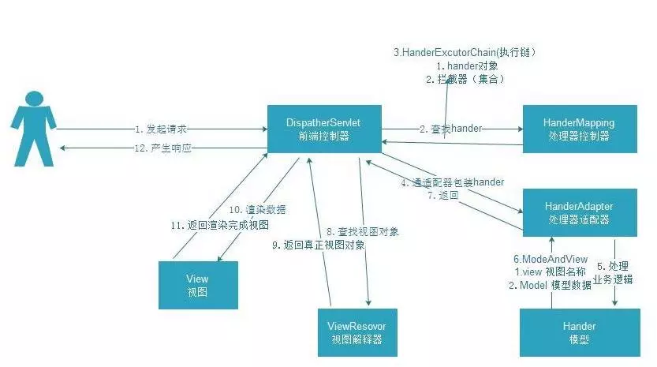

- Spring MVC 将所有的请求都提交给 `DispatcherServlet`，它会委托应用系统的其他模块负责对请求进行真正的处理工作。
- `DispatcherServlet` 查询一个或多个 `HandlerMapping`，找到处理请求的 Controller.
- `DispatcherServlet` 请求提交到目标 Controller
- Controller 进行业务逻辑处理后，会返回一个 `ModelAndView`
- Dispatcher 查询一个或多个 `ViewResolver` 视图解析器,找到 `ModelAndView` 对象指定的视图对象
- 视图对象负责渲染返回给客户端。

