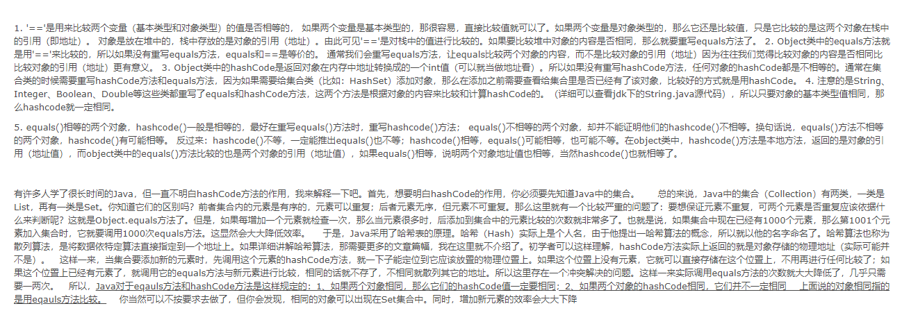

> HashSet 和 HashMap 一直都是JDK 中最常用的两个类，HashSet 要求不能存储相同的对象，HashMap 要求不能存储相同的键。那么 Java 运行时环境是如何判断 HashSet 中相同的对象、HashMap 中相同的键呢？当存储了”相同的内容“之后 Java 运行时环境又将如何来维护呢？


在研究这个问题之前，首先说明一下 JDK 对 equals(Object obj) 和 hashcode() 这两个方法的定义和规范：在 Java 中任何一个对象都具备  equals(Object obj) 和 hashcode() 这两个方法，因为他们都是在 Object 类中定义的。

- equals(Object obj) 方法用来判断两个对象是否”相同“，如果”相同“则返回true，否则返回false
- hashcode() 方法返回一个 int 数，在 Object 类中的默认实现是：将该对象的内部地址转换成一个整数返回

两个重要规范：

1. 若重写 equals(Object obj) 方法，有必要重写 hashcode() 方法，确保通过 equals(Object obj) 方法判断结果未 true 的两个对象具备相等的 hashcode() 返回值。说的简单点就是：”如果两个对象相同，那么他们的 hashcode 应该 ”相等““。不过请注意：这个只是规范，如果你非要写一个类让 equals(Object obj) 返回 true，而hashcode() 返回两个不相等的值，编译和运行都是不会报错的。不过这样违反了 java 规范，程序也就埋下了 BUG。
2. 如果 equals(Object obj) 返回 false，即两个对象”不相同“，并不要求这两个对象的 hashcode() 方法得到两个不相同的数。说的简单点就是：”如果两个对象不相同，但是他们的 hashcode 可能相同“

根据这两个规范，可以得到如下推论：

1. 如果两个对象 equals，Java 运行时环境会认为他们的 hashcode 一定相等
2. 如果两个对象不 equals，他们的 hashcode 有可能相等
3. 如果两个对象 hashcode 相等，他们不一定 equals
4. 如果两个对象 hashcode 不相等，他们一定不 equals

这样推断Java运行时环境怎样判断 HashSet 和 HashMap 中的两个对象是否相同：先判断 hashcode 是否相等，再判断是否 equals。


测试程序如下：先定义一个类，重写 hashCode() 和 equals(Object obj) 方法

```java
package com.seven.demo.utils;

import java.util.HashMap;
import java.util.Map;

/**
 * @author QH
 * @date 2019/8/23
 * @description
 */
public class repeat {

    public static void main(String[] args) {
        Map<A, Object> map = new HashMap<A, Object>();
        map.put(new A(), new Object());
        map.put(new A(), new Object());

        System.out.println(map.size());
    }

}

class A {

    /**
     *  重写hashcode() 方法，返回1，一定相同
     * equals 方法，返回false，一定不相同
     */

    @Override
    public int hashCode() {
        System.out.println("判断hashcode");
        return 1;
    }

    @Override
    public boolean equals(Object obj) {
        System.out.println("判断equals");
        return false;
    }
}
```

运行之后打印结果是：

```java
判断hashcode
判断hashcode
判断equals
2
```

可以看出：Java 运行时环境会调用 new A() 这个对象的 hashcode() 方法。其中：第一次“判断hashcode” 是第一次“map.put(new A(), new Object());” 打印出来的。接下来的“判断hashcode”和“判断equals”是第二次“map.put(new A(), new Object());”所打印出来的。

分析：

1、当第一次“map.put(new A(), new Object());”的时候，Java 运行时环境就会判断这个map里面有没有和现在添加的这个“new A()” 对象相同的键，判断方式就是调用 new A() 对象的 hashcode() 方法，判断 map 中当前是不是存在和 new A() 对象相同的 hashcode值。显然，这个时候没有相同的，因为map为空，所以 hashcode 不相等，则没有必要判断 equals(Object obj) 方法了。

2、当第二次“map.put(new A(), new Object());” 得时候，Java 运行时环境再次判断，这个时候发现了map 中有两个相同的 hashcode（因为重写了hashcode() 方法，永远返回 1），所以有必要调用  equals(Object obj) 方法进行判断，然后发现两个对象不 equals（因为重写了equals(Object obj)  方法，永远返回 false）

3、这个时候判断结束，判断结果：两次存入的对象不是相同的对象，所以map 打印长度为： 2

改写程序如下：

```java
class A {

    /**
     *  重写hashcode() 方法，返回1，一定相同
     * equals 方法，返回true，一定不相同
     */

    @Override
    public int hashCode() {
        System.out.println("判断hashcode");
        return 1;
    }

    @Override
    public boolean equals(Object obj) {
        System.out.println("判断equals");
        return true;
    }
}
```

运行之后打印结果为：

```
判断hashcode
判断hashcode
判断equals
1
```

显然这时候map 长度变为1了，因为 Java 运行时环境认为存入了 两个相同的对象。

以上分析的是 HashMap ，其实 HashSet 的底层本身就是通过 HashMap 来实现的，所以他的判断原理和 HashMap 是一样的，也是先判断 hashcode 再判断 equals。

