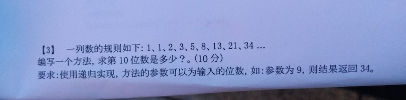

### 代码：

```java
import java.util.Scanner;

public class digui{
	public static void main(String[] args) {
		Scanner sc = new Scanner(System.in);
        System.out.println("请输入大於等於3的位数：");
        int n = sc.nextInt();
        int b = 1;
        int a = 1;
        int c;
        for (int i = 3; i <= n; i++) {
            c = a + b;
            b = a;
            a = c;
            if (i == n) {
                System.out.println(c);
                break;
            }
        }
	}
}
```

### 运行：

```java
javac digui.java

java digui
```

