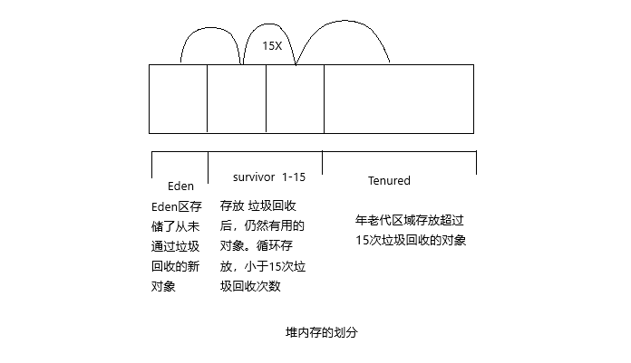

分代垃圾回收机制，是基于这样一个事实：不同的对象的生命周期是不一样的。因此，不同声明周期的对象可以采取不同的回收算法，以便提高回收效率。我们将对象分为三种状态：年轻代、年老代、持久代。JVM 将堆内存划分为 Eden、Survivor 和 Tenured/Old 空间。

1. 年轻代

   所有新生成的对象首先都是放在 Eden 区。年轻代的目标都是尽可能快速的收集掉那些生命周期短的对象，对应的是 Minor GC，每次Minor GC 会清理年轻代的内存，算法采用效率较高的复制算法，频繁的操作，但是会浪费内存空间。当“年轻代”区域存放满对象后，就将对象存放到年老代区域。

2. 年老代

   在年轻代中经历了 N（默认15）次垃圾回收后依然存活的对象，就会被放到年老代中。因此，可以认为年老代中存放的都是一些生命周期较长的对象。年老代对象越来越多，我们就需要启动 Major GC 和 Full GC（全量回收），来一次大扫除，全面清理年轻代区域和年老代区域。

3. 持久代

   用于存放静态文件，如 Java 类、方法等。持久代对垃圾回收没有显著影响。

   

- Minor GC：

  用于清理年轻代区域。Eden 区满了就会触发一次 Minor GC。清理无用对象，将有用对象复制到“Survisor1”、“Survisor2”区中（这两个区，大小空间也相同，同一时刻只有一个在用，一个为空）

- Major GC：

  用于清理老年代区域

- Full GC：

  用于清理年轻代、年老代区域。成本较高，会对系统性能产生影响。

### 垃圾回收过程：

1. 新创建的对象，绝大多数都会存储在 Eden 中
2. 当 Eden 满了（达到一定比例）不能创建新对象，则触发垃圾回收（GC），将无用对象清理掉，然后剩余对象复制到某个 Survivor 中，如 S1，同时清空 Eden 区
3. 当 Eden 区再次满了，会将 S1 中的不能清空对象存到另外一个 Survivor 中，如 S2，同时将Eden区中的不能清空的对象，也复制到 S1 中，保证 Eden 和 S1均被清空
4. 重复多次（默认15次）Survivor 中没有被清理的对象，则会复制到老年代 Old（Tenured）中
5. 当 Old 区满了，则会触发一个一次完整的垃圾回收（Full GC），之前新生代的垃圾回收称为（Minor GC）

### JVM 调优和 Full GC

在对 JVM 调优的过程中，很大一部分工作就是对于 Full GC 的调节。有如下原因可能导致 Full GC：

1. 年老代（Tenured）被写满
2. 持久代（Perm）被写满
3. System.gc(); 被显式调用（程序建议 GC 启动，不是调节 GC）
4. 上一次 GC 之后 Heap 的各域分配策略动态变化