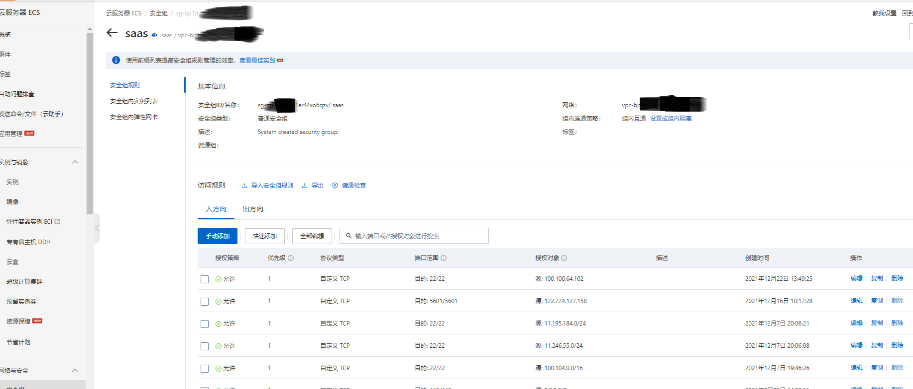
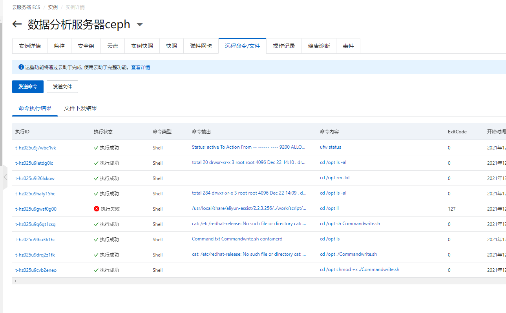
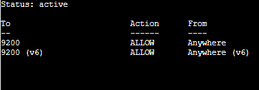
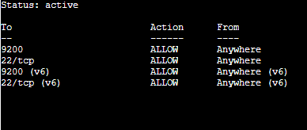

## 通过私网IP(VPC网络)访问实例需要在实例安全组白名单中增加Workbench的服务器私网白名单

在安全组规则中为22端口添加了入方向的规则之后

仍然是报这个错误。。。这种情况登录不了服务器可以使用阿里云的云助手发送远程命令或文件

- 查看防火墙的状态，使用 `ufw status` 命令

上图可知，22 端口没有被防火墙允许，使用 `ufw allow ssh` 打开

