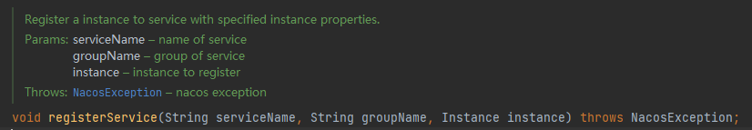
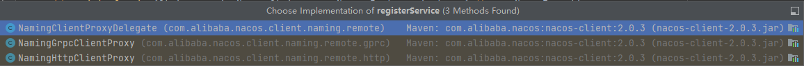
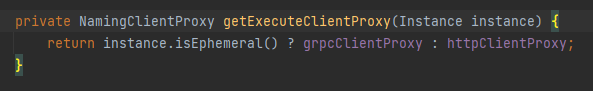

## nacos-client-2.0.3

> nacos 1\2 版本有很大不同，2.x 版本使用 grpc长链接代替心跳检测

首先看一下 `com.alibaba.nacos.api.naming.pojo` 这个包下的 `Instance` 这个类，它包含了注册到 Nacos 服务端的实例的元数据信息，包含实例id、ip、端口、权重、服务名等信息

> 这个类中有一个字段值得注意：`ephemeral` 这个字段，用来标识临时实例还是持久化实例，默认为临时实例（客户端自注册模式即为临时实例）。如果是临时实例，则不会在 Nacos 服务端持久化存储，需要通过上报心跳的方式来保持健康状态，如果一段时间没有上报心跳，则会被 Nacos 服务端剔除。持久化实例则会被持久化到 Nacos 服务端，健康检查失败后会被标记为不健康状态，不会从列表中被删除。
>
> 这个特性比较适合那些需要应对流量突增，而弹性扩容的服务，当流量降下来之后这些实例自己销毁自己就可以了。这些持久化的实例可以实时看到健康状态，便于做后续的告警、扩容等一系列处理！？
>
> ```yaml
> # false表示永久实例  true表示临时实例
> spring.cloud.nacos.discovery.ephemeral=false
> ```

当客户端服务启动的时候，会注册到 Nacos 服务端，`com.alibaba.nacos.client.naming.remote` 包下的 `NamingClientProxy` 接口类中 `registerService` 接口，参数为 服务名、组名以及实例的元数据。



该接口有三个实现：



首先看第一个代理类，代理类会根据 `ephemeral` 参数选择不同的Grpc代理还是Http代理



> 当实例是临时实例时使用 grpc，持久化实例使用 http，两种不同的实例使用不同的健康上报模式，临时实例通过 grpc 长链接上报，持久化实例使用服务端主动检测模式。