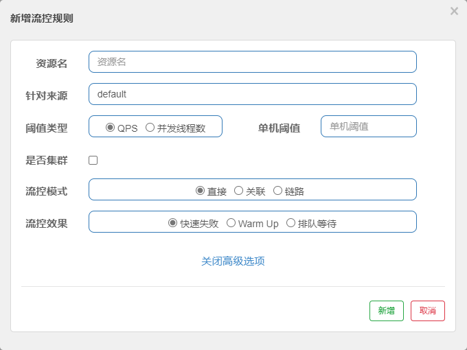

## 概述

流控规则简介：

- 资源名：唯一名称，默认请求路径
- 针对来源：Sentinel 可以针对调用者进行限流，填写微服务名，默认 default（不区分来源）
- 阈值类型/单机阈值
  - QPS（每秒钟的请求数量）：当调用该api的QPS达到阈值的时候，进行限流
  - 线程数：当调用该api的线程数达到阈值的时候，进行限流
- 是否集群：不需要集群
- 流控模式：
  - 直接：api达到限流条件时，直接限流
  - 关联：当关联的资源达到阈值时，就限流自己
  - 链路：只记录指定链路上的流量（指定资源从入口资源进来的流量，如果达到阈值，就进行限流）【api级别的针对来源】
- 流控效果：
  - 快速失败：直接失败，抛异常
  - Warm Up：根据 codeFactory（冷加载因子，默认3）的值，从阈值/codeFactor，经过预热时长，才达到设置的QPS阈值
  - 排队等待：匀速排队，让请求以匀速的速度通过，阈值类型必须设置为QPS，否则无效

[尚硅谷SpringCloud框架开发教程(SpringCloudAlibaba微服务分布式架构丨Spring Cloud)_哔哩哔哩_bilibili](https://www.bilibili.com/video/BV18E411x7eT?p=118)