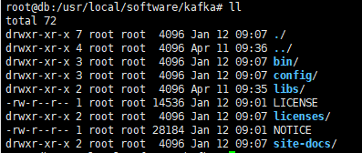

kafka 的安装依赖与 zookeeper，下面操作之前，首先要安装好 [**zookeeper**](zookeeper.md)

## 集群部署

1. 首先下载安装包

   https://kafka.apache.org/downloads

2. 上传到服务器 `/usr/local/software` 下，并解压

   ```bash
   tar -zxvf kafka_2.13-3.1.0.tgz
   mv kafka_2.13-3.1.0/ kafka
   ```

3. 目录结构为

   

4. 进入到 config 目录中，修改配置文件 server.properties

   ```
   1、修改 broker.id=x
   2、修改 log.dirs=xxx
   3、修改 zookeeper.connect=192.168.80.232:2181,192.168.80.234:2181,192.168.80.236:2181/kafka
   ```

5. 启动 kafka

   ```bash
   bin/kafka-server-start.sh -daemon config/server.properties
   ```

6. 使用 jps 命令查看启动的进程

   

7. 停止命令

   ```
   bin/kafka-server-stop.sh
   ```

   