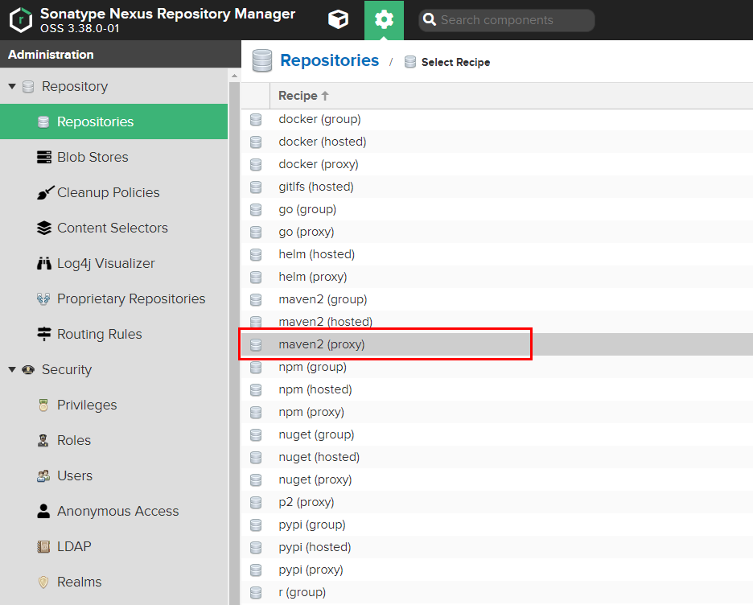

实际企业开发过程中所有依赖都会走私服下载，需要在 Nexus 上配置相对应的 Maven 代理

## 创建代理仓库

目前只需要配置三个必须的代理仓库（分别为 `aliyun-nexus`、`spring-milestone`、`spring-snapshot`），如果你有其它的代理仓库配置流程同下

- 登录 `Nexus` 服务器
- 点击 `设置按钮` -> `Repository` -> `Repositories`



- 配置阿里云仓库代理（版本策略为 Release）
  - Name：`aliyun-nexus`
  - Version policy：`Release`
  - Remote storate：`http://maven.aliyun.com/nexus/content/groups/public/`


## 配置镜像仓库

- 修改 `<mirrors>` 元素
  - id：需要与 `server` 元素中的 `id` 匹配
  - mirrorOf：可以填入 `central` 或 `*` （所有依赖均通过私服下载）
  - name：随便
  - url：仓库地址

```
<mirror>
	<id>nexus-public</id>
	<mirrorOf>*</mirrorOf>
	<name>Nexus Public</name>
	<url>http://192.168.228.18:8081/repository/maven-public/</url>
</mirror>
```

