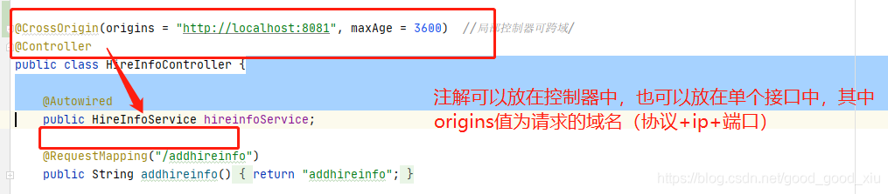
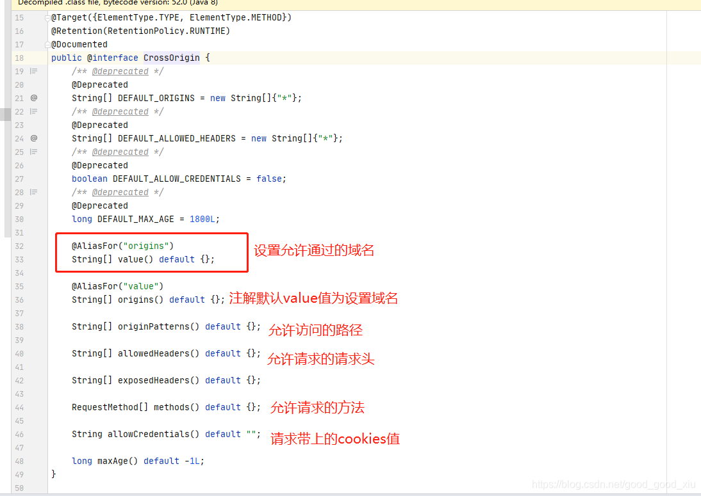
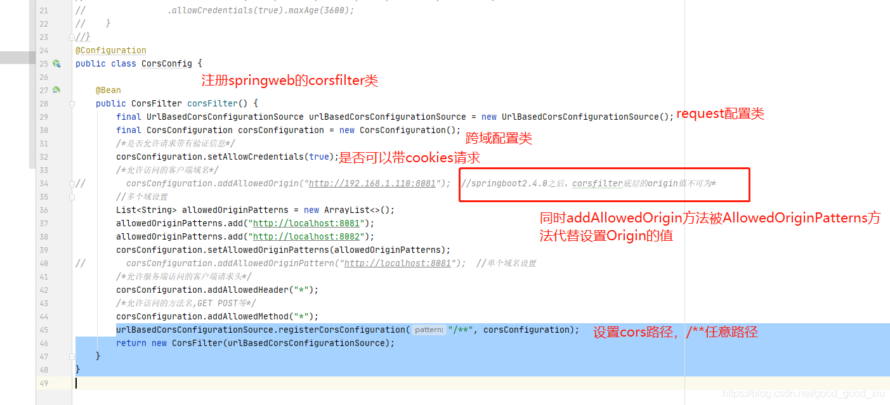

## 概述

在浏览器端进行 Ajax 请求时会出现跨域问题，那么什么是跨域，如何解决跨域呢？先看浏览器端出现跨域问题的现象，如下图所示


## 什么是跨域问题？

跨域，指的是浏览器不能执行其他网站的脚本。它是由浏览器的同源策略造成的，是浏览器对 JavaScript 施加的安全限制。

## 什么是同源？

所谓同源是指，域名，协议，端口均相同

- http://www.funtl.com --> http://admin.funtl.com 跨域
- http://www.funtl.com --> http://www.funtl.com 非跨域
- http://www.funtl.com --> http://www.funtl.com:8080 跨域
- http://www.funtl.com --> https://www.funtl.com 跨域

## 如何解决跨域问题？

### 1、使用@CrossOrigin注解





### 2、使用corsfilter过滤器



代码片段：

```
import org.springframework.context.annotation.Bean;
import org.springframework.context.annotation.Configuration;
import org.springframework.web.cors.CorsConfiguration;
import org.springframework.web.cors.UrlBasedCorsConfigurationSource;
import org.springframework.web.filter.CorsFilter;
import java.util.ArrayList;
import java.util.List;

@Configuration
public class CorsConfig {

    @Bean
    public CorsFilter corsFilter() {
        final UrlBasedCorsConfigurationSource urlBasedCorsConfigurationSource = new UrlBasedCorsConfigurationSource();
        final CorsConfiguration corsConfiguration = new CorsConfiguration();
        //是否允许请求带有验证信息
        corsConfiguration.setAllowCredentials(true);
		corsConfiguration.addAllowedOriginPattern("http://localhost:8081");  //单个域名设置
        /*允许服务端访问的客户端请求头*/
        corsConfiguration.addAllowedHeader("*");
        /*允许访问的方法名,GET POST等*/
        corsConfiguration.addAllowedMethod("*");
        //注册url路径，/**为全部路径匹配
        urlBasedCorsConfigurationSource.registerCorsConfiguration("/**", corsConfiguration);
        return new CorsFilter(urlBasedCorsConfigurationSource);
    }
}
```

### 3、全局跨域设置。（推荐）

继承WebMvcConfigurer，通过addCorsMappings方法实现跨域访问：

```
import org.springframework.web.servlet.config.annotation.CorsRegistry;
import org.springframework.web.servlet.config.annotation.WebMvcConfigurer;

@Configuration
public class CorsConfig implements WebMvcConfigurer {
    @Override
    public void addCorsMappings(CorsRegistry registry) { 
    	// 注册路径                             //注册所有域名
        registry.addMapping("/**").allowedOriginPatterns("*")
        		//注册可以请求的方法
                .allowedMethods("GET", "HEAD", "POST","PUT", "DELETE", "OPTIONS")
                .allowCredentials(true).maxAge(3600);
    }
}
```

### 4、使用 Nginx 反向代理解决跨域问题

 以上跨域问题解决方案都需要服务器支持，当服务器无法设置 `header` 或提供 `callback` 时我们就可以采用 Nginx 反向代理的方式解决跨域问题。 

 **add_header**:添加响应头信息。（**跨域访问，并不是请求不到数据，而是接收不到数据**）。所以，我们可以在响应头中添加对应origin值，**add_header Access-Control-Allow-Origin $http_origin;** 这样浏览器就不会拦截。 

 以下为文件上传的跨域配置方案： 

```
user  nginx;
worker_processes  1;

events {
    worker_connections  1024;
}

http {
    include       mime.types;
    default_type  application/octet-stream;

    sendfile        on;

    keepalive_timeout  65;

    server {
        listen 80;
        server_name upload.myshop.com;
        add_header 'Access-Control-Allow-Origin'  '*';
        add_header 'Access-Control-Allow-Headers' 'DNT,X-CustomHeader,Keep-Alive,User-Agent,X-Requested-With,If-Modified-Since,Cache-Control,Content-Type,Content-Range,Range';
        location / {
            proxy_pass  http://192.168.0.104:8888;
            if ($request_method = 'OPTIONS') {
                add_header Access-Control-Allow-Origin  *;
                add_header Access-Control-Allow-Headers X-Requested-With;
                add_header Access-Control-Allow-Methods GET,POST,PUT,DELETE,PATCH,OPTIONS;
                # 解决假请求问题，如果是简单请求则没有这个问题，但这里是上传文件，首次请求为 OPTIONS 方式，实际请求为 POST 方式
                # Provisional headers are shown.
                # Request header field Cache-Control is not allowed by Access-Control-Allow-Headers in preflight response.
                add_header Access-Control-Allow-Headers DNT,X-CustomHeader,Keep-Alive,User-Agent,X-Requested-With,If-Modified-Since,Cache-Control,Content-Type,Content-Range,Range;
                return 200;
            }
        }
    }
}
```

```
events {
		worker_connections  1024;
	}
http{
	
	server {
			   listen 8081;
			   server_name 192.168.1.100;

			   location / {
			   		proxy_set_header Host $http_host;
					proxy_set_header X-Real-IP $remote_addr;
					proxy_set_header REMOTE-HOST $remote_addr;
					proxy_set_header X-Forwarded-For $proxy_add_x_forwarded_for;
					proxy_pass http://192.168.1.100:8082;
			   if ($request_method = 'OPTIONS') {
						add_header Access-Control-Allow-Origin $http_origin;	
						add_header Access-Control-Allow-Credentials true;
						add_header Access-Control-Allow-Methods $http_access_control_request_method;
						add_header Access-Control-Allow-Headers $http_access_control_request_headers;
						add_header Access-Control-Max-Age 1728000;
						add_header Content-Length 300;
						return 204;
					}
				}
			}	
}
```

