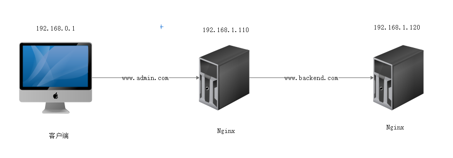

## 问题描述

在一次生产环境中涉及多次转发的配置中，需求如下：



在配置好了 proxy_pass 之后，请求 `www.admin.com` 直接返回 404，没有什么其他的异常。 

但是我们直接请求后端 `www.backend.com` 是正常响应的。这就很怪异的。 看日志请求也是转发到了 `www.backend.com` 的。但是请求响应就是404. 

## 问题分析

默认的 Nginx 的 `proxy_set_header` 配置是：

```
proxy_set_header Host $host;
```

- 服务端： 192.168.0.1
- 服务端1：192.168.1.110 Nginx1
- 服务端2：192.168.1.120 Nginx2

在第一层 Nginx 代理后，请求的域名是 `www.admin.com`，请求中 `host` 的值是 `www.admin.com`，通过配置 ` proxy_set_header Host $host; ` 将 `host` 的值设置为转发的 `host` 值，但是请求的域名是 `www.backend.com`，也就是转发到第二台nginx 服务器时，header里面的 host 值是 `www.admin.com`，请求的 host 是 `www.backend.com`，请求的域名和 header 里面的 host 不一致导致的 404 问题

## 问题解决

[官方文档](https://nginx.org/en/docs/http/ngx_http_proxy_module.html#proxy_set_header)

[常用的配置](nginx/proxy-set-header.md)

修改配置为：

```
proxy_set_header Host $proxy_host;
```