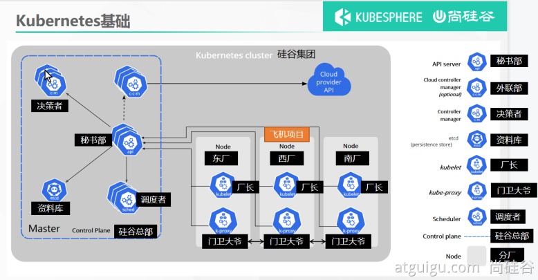

## Kubernetes Master

- **kube-apiserver：** 提供了资源操作的唯一入口，并提供认证、授权、访问控制、API 注册和发现等机制。kube-apiserver 设计上考虑了水平伸缩，也就是说，它可通过部署多个实例进行伸缩。 你可以运行 kube-apiserver 的多个实例，并在这些实例之间平衡流量。

- **kube-scheduler：** 负责资源的调度，按照预定的调度策略将 Pod 调度到相应的机器上

- **kube-controller-manager：** 负责维护集群的状态，比如故障检测、自动扩展、滚动更新等

  这些控制器包括:

  - 节点控制器（Node Controller）: 负责在节点出现故障时进行通知和响应
  - 任务控制器（Job controller）: 监测代表一次性任务的 Job 对象，然后创建 Pods 来运行这些任务直至完成

  - 端点控制器（Endpoints Controller）: 填充端点(Endpoints)对象(即加入 Service 与 Pod)
  - 服务帐户和令牌控制器（Service Account & Token Controllers）: 为新的命名空间创建默认帐户和 API 访问令牌

- **etcd：** CoreOS 基于 Raft 开发的分布式 key-value 存储，可用于服务发现、共享配置以及一致性保障（如数据库选主、分布式锁等）。要了解 etcd 更深层次的信息，请参考 [etcd 文档](https://etcd.io/docs/)。

## Kubernetes Node

- **runtime：** 负责镜像管理以及 Pod 和容器的真正运行（CRI，Container Runtime Interface），默认的容器运行时为 Docker，还支持 RKT 容器
- **kubelet：** 负责维持容器的生命周期，同时也负责 Volume（CVI，Container Volume Interface）和网络（CNI，Container Network Interface）的管理
- **kube-proxy：** 负责为 Service 提供 cluster 内部的服务发现和负载均衡

## Kubernetes 架构

