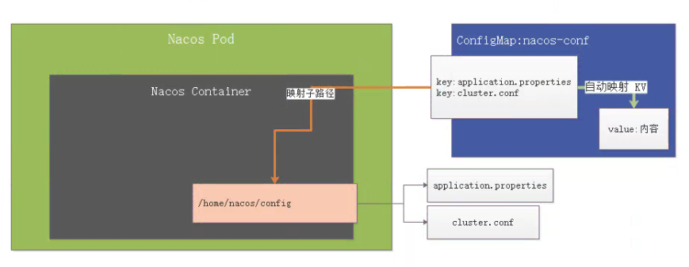
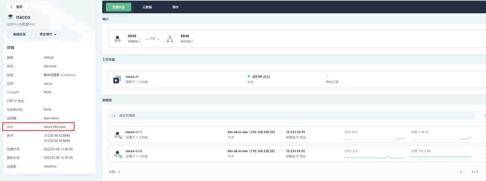
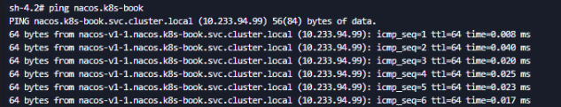
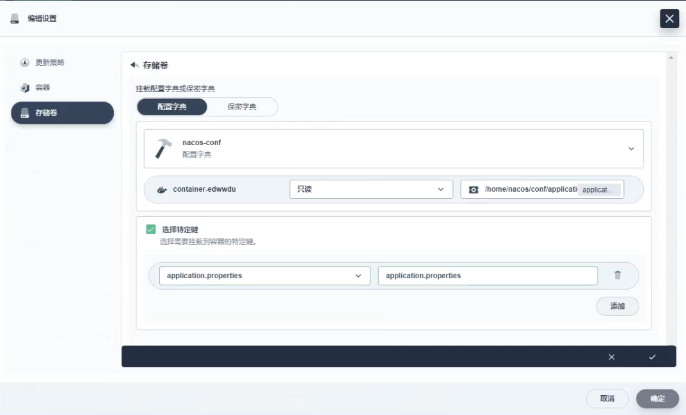
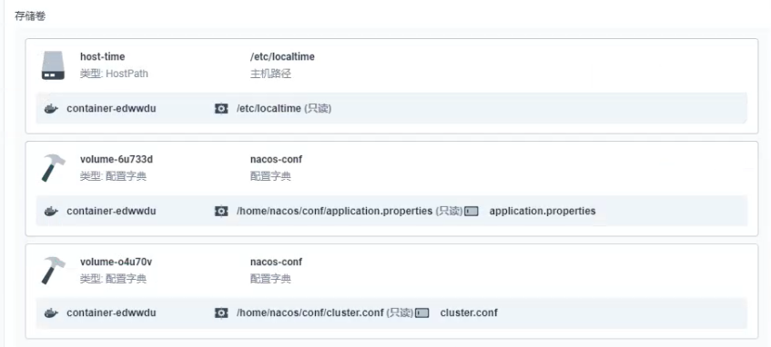
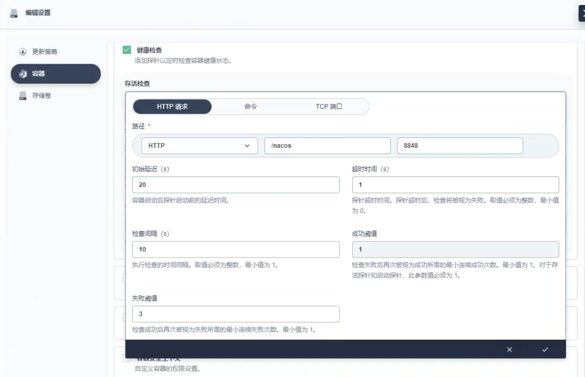

## nacos 部署分析

nacos 集群部署需要配置一个集群配置文件 `cluster.conf`，文件内容每行配置一个 nacos 实例的 ip:port，k8s 故障转移可能会造成 pod 的 ip 发生变化，所以 nacos 要部署成一个 StatefulSet，使每个 nacos 有一个固定的域名



需要挂载两个配置文件：`/home/nacos/conf` 下的 `application.yml` 和 `cluster.conf` 两个配置文件

> 注意：一定要是子路径挂载，因为 conf 目录下不止有这两个文件，只有使用子路径挂载，才不会导致丢失其他的配置文件

## nacos 部署

启动一个 nacos StatefulSet




在集群内任意一个容器内 ping 这个 dns 地址会负载均衡到工作负载下的容器组中




可见规则为：pod名.服务名.项目名.svc.cluster.local

### 初始化数据源

首先创建要使用的数据库，并创建好对应的表和数据。然后配置 application.properties 中的 db 配置

```properties
spring.datasource.platform=mysql

db.num=1
db.url.0=jdbc:mysql://mysql.k8s:3306/nacos_devtest?characterEncoding=utf8&connectTimeout=1000&socketTimeout=3000&autoReconnect=true
db.user=nacos_devtest
db.password=youdontknow
```

### 创建 configMap

- application.properties

  ```
  #*************** Spring Boot Related Configurations ***************#
  ### Default web context path:
  server.servlet.contextPath=/nacos
  ### Default web server port:
  server.port=8848
  
  #*************** Network Related Configurations ***************#
  ### If prefer hostname over ip for Nacos server addresses in cluster.conf:
  # nacos.inetutils.prefer-hostname-over-ip=false
  
  ### Specify local server's IP:
  # nacos.inetutils.ip-address=
  
  
  #*************** Config Module Related Configurations ***************#
  ### If use MySQL as datasource:
  spring.datasource.platform=mysql
  
  ### Count of DB:
  db.num=1
  
  ### Connect URL of DB:
  db.url.0=jdbc:mysql://mysql-headless.k8s-book:3306/nacos_config?characterEncoding=utf8&connectTimeout=1000&socketTimeout=3000&autoReconnect=true&useUnicode=true&useSSL=false&serverTimezone=UTC
  db.user.0=root
  db.password.0=123456
  
  ### Connection pool configuration: hikariCP
  db.pool.config.connectionTimeout=30000
  db.pool.config.validationTimeout=10000
  db.pool.config.maximumPoolSize=20
  db.pool.config.minimumIdle=2
  
  #*************** Naming Module Related Configurations ***************#
  ### Data dispatch task execution period in milliseconds: Will removed on v2.1.X, replace with nacos.core.protocol.distro.data.sync.delayMs
  # nacos.naming.distro.taskDispatchPeriod=200
  
  ### Data count of batch sync task: Will removed on v2.1.X. Deprecated
  # nacos.naming.distro.batchSyncKeyCount=1000
  
  ### Retry delay in milliseconds if sync task failed: Will removed on v2.1.X, replace with nacos.core.protocol.distro.data.sync.retryDelayMs
  # nacos.naming.distro.syncRetryDelay=5000
  
  ### If enable data warmup. If set to false, the server would accept request without local data preparation:
  # nacos.naming.data.warmup=true
  
  ### If enable the instance auto expiration, kind like of health check of instance:
  # nacos.naming.expireInstance=true
  
  ### will be removed and replaced by `nacos.naming.clean` properties
  nacos.naming.empty-service.auto-clean=true
  nacos.naming.empty-service.clean.initial-delay-ms=50000
  nacos.naming.empty-service.clean.period-time-ms=30000
  
  ### Add in 2.0.0
  ### The interval to clean empty service, unit: milliseconds.
  # nacos.naming.clean.empty-service.interval=60000
  
  ### The expired time to clean empty service, unit: milliseconds.
  # nacos.naming.clean.empty-service.expired-time=60000
  
  ### The interval to clean expired metadata, unit: milliseconds.
  # nacos.naming.clean.expired-metadata.interval=5000
  
  ### The expired time to clean metadata, unit: milliseconds.
  # nacos.naming.clean.expired-metadata.expired-time=60000
  
  ### The delay time before push task to execute from service changed, unit: milliseconds.
  # nacos.naming.push.pushTaskDelay=500
  
  ### The timeout for push task execute, unit: milliseconds.
  # nacos.naming.push.pushTaskTimeout=5000
  
  ### The delay time for retrying failed push task, unit: milliseconds.
  # nacos.naming.push.pushTaskRetryDelay=1000
  
  ### Since 2.0.3
  ### The expired time for inactive client, unit: milliseconds.
  # nacos.naming.client.expired.time=180000
  
  #*************** CMDB Module Related Configurations ***************#
  ### The interval to dump external CMDB in seconds:
  # nacos.cmdb.dumpTaskInterval=3600
  
  ### The interval of polling data change event in seconds:
  # nacos.cmdb.eventTaskInterval=10
  
  ### The interval of loading labels in seconds:
  # nacos.cmdb.labelTaskInterval=300
  
  ### If turn on data loading task:
  # nacos.cmdb.loadDataAtStart=false
  
  
  #*************** Metrics Related Configurations ***************#
  ### Metrics for prometheus
  #management.endpoints.web.exposure.include=*
  
  #*************** Access Log Related Configurations ***************#
  ### If turn on the access log:
  server.tomcat.accesslog.enabled=true
  
  ### The access log pattern:
  server.tomcat.accesslog.pattern=%h %l %u %t "%r" %s %b %D %{User-Agent}i %{Request-Source}i
  
  ### The directory of access log:
  server.tomcat.basedir=
  
  #*************** Access Control Related Configurations ***************#
  ### If enable spring security, this option is deprecated in 1.2.0:
  #spring.security.enabled=false
  
  ### The ignore urls of auth, is deprecated in 1.2.0:
  nacos.security.ignore.urls=/,/error,/**/*.css,/**/*.js,/**/*.html,/**/*.map,/**/*.svg,/**/*.png,/**/*.ico,/console-ui/public/**,/v1/auth/**,/v1/console/health/**,/actuator/**,/v1/console/server/**
  
  ### The auth system to use, currently only 'nacos' and 'ldap' is supported:
  nacos.core.auth.system.type=nacos
  
  ### If turn on auth system:
  nacos.core.auth.enabled=false
  
  ### worked when nacos.core.auth.system.type=ldap，{0} is Placeholder,replace login username
  # nacos.core.auth.ldap.url=ldap://localhost:389
  # nacos.core.auth.ldap.userdn=cn={0},ou=user,dc=company,dc=com
  
  ### The token expiration in seconds:
  nacos.core.auth.default.token.expire.seconds=18000
  
  ### The default token:
  nacos.core.auth.default.token.secret.key=SecretKey012345678901234567890123456789012345678901234567890123456789
  
  ### Turn on/off caching of auth information. By turning on this switch, the update of auth information would have a 15 seconds delay.
  nacos.core.auth.caching.enabled=true
  
  ### Since 1.4.1, Turn on/off white auth for user-agent: nacos-server, only for upgrade from old version.
  nacos.core.auth.enable.userAgentAuthWhite=false
  
  ### Since 1.4.1, worked when nacos.core.auth.enabled=true and nacos.core.auth.enable.userAgentAuthWhite=false.
  ### The two properties is the white list for auth and used by identity the request from other server.
  nacos.core.auth.server.identity.key=serverIdentity
  nacos.core.auth.server.identity.value=security
  
  #*************** Istio Related Configurations ***************#
  ### If turn on the MCP server:
  nacos.istio.mcp.server.enabled=false
  
  #*************** Core Related Configurations ***************#
  
  ### set the WorkerID manually
  # nacos.core.snowflake.worker-id=
  
  ### Member-MetaData
  # nacos.core.member.meta.site=
  # nacos.core.member.meta.adweight=
  # nacos.core.member.meta.weight=
  
  ### MemberLookup
  ### Addressing pattern category, If set, the priority is highest
  # nacos.core.member.lookup.type=[file,address-server]
  ## Set the cluster list with a configuration file or command-line argument
  # nacos.member.list=192.168.16.101:8847?raft_port=8807,192.168.16.101?raft_port=8808,192.168.16.101:8849?raft_port=8809
  ## for AddressServerMemberLookup
  # Maximum number of retries to query the address server upon initialization
  # nacos.core.address-server.retry=5
  ## Server domain name address of [address-server] mode
  # address.server.domain=jmenv.tbsite.net
  ## Server port of [address-server] mode
  # address.server.port=8080
  ## Request address of [address-server] mode
  # address.server.url=/nacos/serverlist
  
  #*************** JRaft Related Configurations ***************#
  
  ### Sets the Raft cluster election timeout, default value is 5 second
  # nacos.core.protocol.raft.data.election_timeout_ms=5000
  ### Sets the amount of time the Raft snapshot will execute periodically, default is 30 minute
  # nacos.core.protocol.raft.data.snapshot_interval_secs=30
  ### raft internal worker threads
  # nacos.core.protocol.raft.data.core_thread_num=8
  ### Number of threads required for raft business request processing
  # nacos.core.protocol.raft.data.cli_service_thread_num=4
  ### raft linear read strategy. Safe linear reads are used by default, that is, the Leader tenure is confirmed by heartbeat
  # nacos.core.protocol.raft.data.read_index_type=ReadOnlySafe
  ### rpc request timeout, default 5 seconds
  # nacos.core.protocol.raft.data.rpc_request_timeout_ms=5000
  
  #*************** Distro Related Configurations ***************#
  
  ### Distro data sync delay time, when sync task delayed, task will be merged for same data key. Default 1 second.
  # nacos.core.protocol.distro.data.sync.delayMs=1000
  
  ### Distro data sync timeout for one sync data, default 3 seconds.
  # nacos.core.protocol.distro.data.sync.timeoutMs=3000
  
  ### Distro data sync retry delay time when sync data failed or timeout, same behavior with delayMs, default 3 seconds.
  # nacos.core.protocol.distro.data.sync.retryDelayMs=3000
  
  ### Distro data verify interval time, verify synced data whether expired for a interval. Default 5 seconds.
  # nacos.core.protocol.distro.data.verify.intervalMs=5000
  
  ### Distro data verify timeout for one verify, default 3 seconds.
  # nacos.core.protocol.distro.data.verify.timeoutMs=3000
  
  ### Distro data load retry delay when load snapshot data failed, default 30 seconds.
  # nacos.core.protocol.distro.data.load.retryDelayMs=30000
  ```

- cluster.conf

  ```
  nacos-v1-0.nacos.k8s-book.svc.cluster.local:8848
  nacos-v1-1.nacos.k8s-book.svc.cluster.local:8848
  nacos-v1-2.nacos.k8s-book.svc.cluster.local:8848
  ```

### 配置挂载文件

如果使用挂载目录，键名作为文件名，那么挂载目录中只会存在挂载的键名的文件。所以一定要使用子路径，避免挂载目录下其他不需要挂载的文件丢失





## nacos 存活探针

nacos server 需要依赖 mysql，有可能在 k8s 集群重启的时候，MySQL 还没有准备好，nacos 已经启动了；nacos 没有准备好的情况下，这时依赖 nacos 的 web 应用去连接 nacos，就会出现连接不上，导致大面积应用挂掉，需要给 nacos StatefulSet 配置上健康检查器 - 容器存活检查

