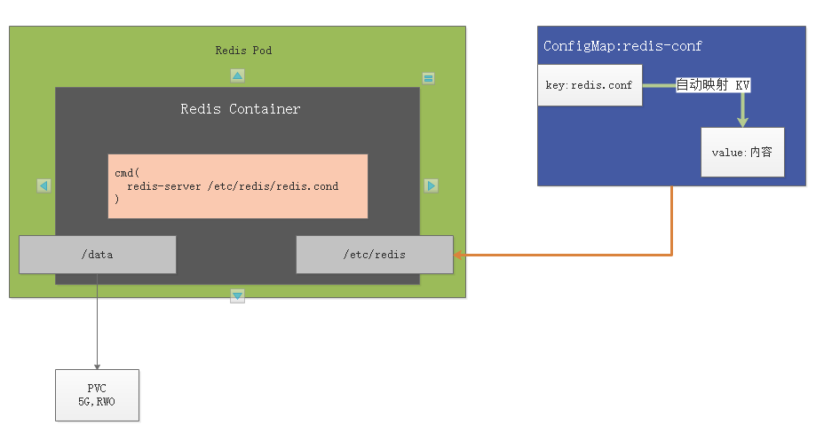
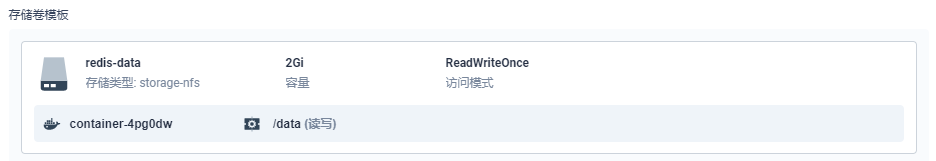
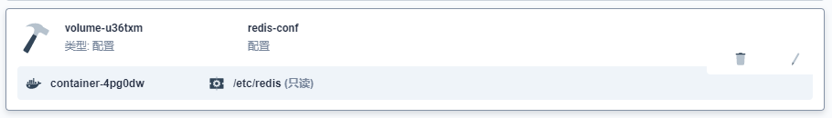

## redis 部署分析



## 概述

redis 启动命令为：`redis-server /etc/redis/redis.conf`

持久化目录：`/data`

配置文件：

- 目录：`/etc/redis`

- 文件名：ConfigMap 中 key 为文件名，value 为文件值。

  举例：redis.conf 为文件名，value 为：

  ```
  appendonly yes
  port 6379
  bind 0.0.0.0
  ```

## docker 启动 redis

```
docker run -d -p 6379:6379 --restart=always \
-v /mydata/redis/conf/redis.conf:/etc/redis/redis.conf \
-v  /mydata/redis-01/data:/data \
 --name redis-01 redis:6.2.5 \
 redis-server /etc/redis/redis.conf
```

## 添加存储卷模板

存储卷模板优点



## 挂载配置



