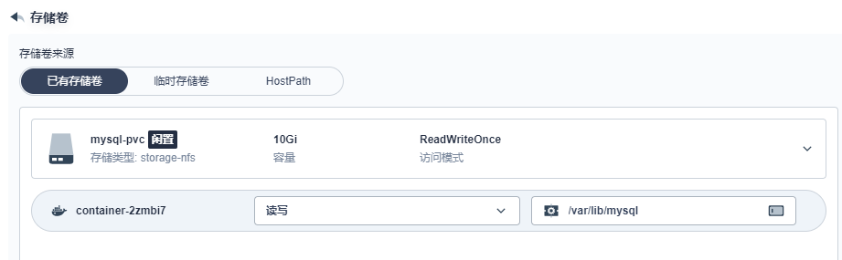
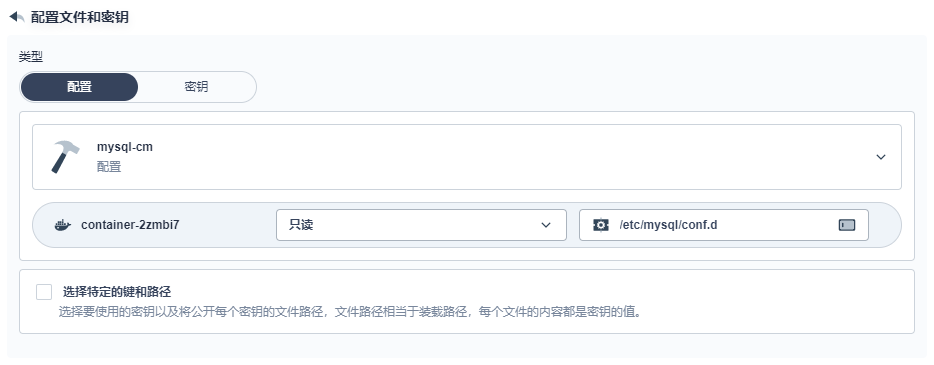

## 概述

- 有状态服务抽取配置为 `ConfigMap`
- 有状态服务必须使用 `pvc` 持久化数据
- 服务集群内访问使用 `DNS` 提供的稳定域名（Pod名+命名空间）

## 创建密钥

命名：`mysql-secret`

类型：`Opaque`

添加数据：

- key：`MYSQL_ROOT_PASSWORD`
- value：`123456`

## 创建存储卷

命名：`mysql-pvc`

存储类型：默认storageClass

访问模式：单节点读写

存储卷容量：10G

由 StorageClass 根据用户声明创建 pv


## 创建配置

key：`my.cnf`

value：

```cnf
[client]
default-character-set=utf8mb4
 
[mysql]
default-character-set=utf8mb4
 
[mysqld]
init_connect='SET collation_connection = utf8mb4_unicode_ci'
init_connect='SET NAMES utf8mb4'
character-set-server=utf8mb4
collation-server=utf8mb4_unicode_ci
skip-character-set-client-handshake
skip-name-resolve
```

## 配置镜像

选择镜像

配置资源限制

配置端口

配置环境变量

## 配置存储卷、挂载配置文件





