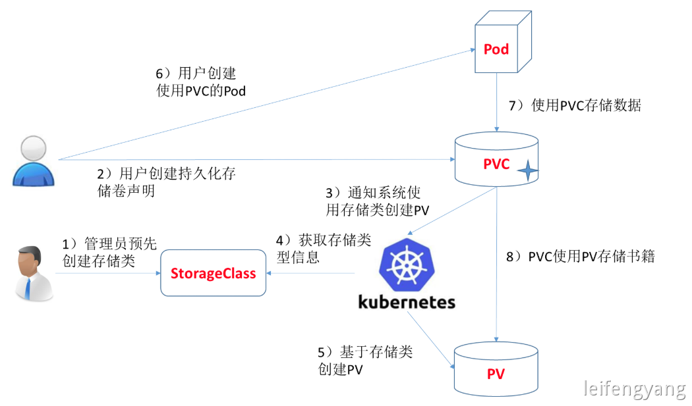

## 概述

- 有状态服务抽取配置为 `ConfigMap`
- 有状态服务必须使用 `pvc` 持久化数据
- 服务集群内访问使用 `DNS` 提供的稳定域名（Pod名+命名空间）

## 创建密钥

命名：`mysql-secret`

类型：`Opaque`

添加数据：

- key：`MYSQL_ROOT_PASSWORD`
- value：`123456`

## 创建存储卷

命名：`mysql-pvc`

存储类型：默认storageClass

访问模式：单节点读写

存储卷容量：10G

由 StorageClass 根据用户声明创建 pv

