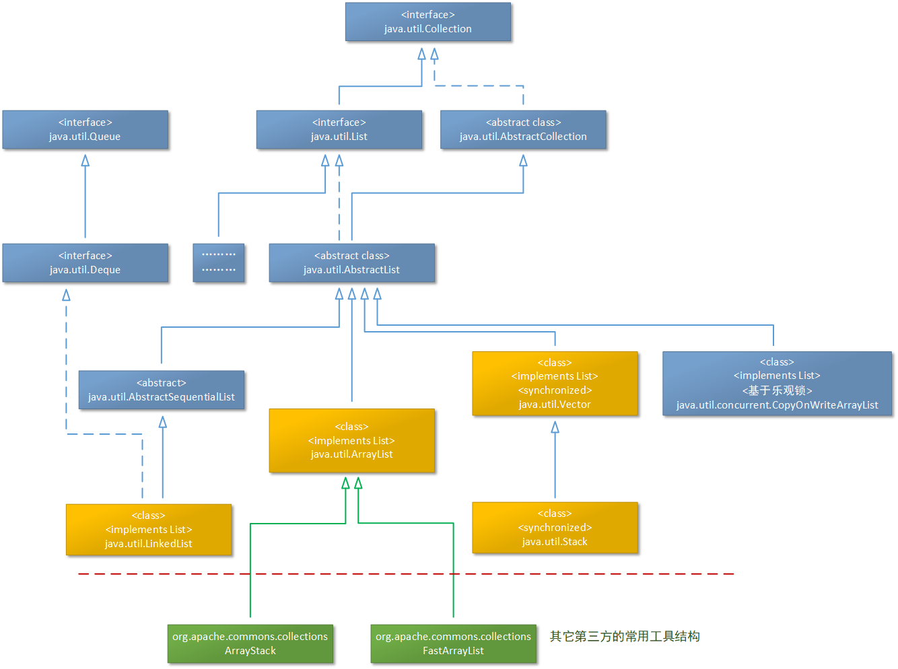

上图中展示了Java中的java.util.List接口所涉及的部分重要接口和抽象类，以及java.util.List接口在java.util包中的具体实现类。其中以黄色表示的类就是本文将要介绍的java.util包中关于List接口的重要实现类，他们分别是java.util.ArrayList、java.util.LinkedList、java.util.Vector和java.util.Stack。其中Vector和Stack这两个类是继承关系（从上图中就可以看出），他们从JDK1.0开始就被提供出来供开发人员使用，后来又被性能和设计都更好的其它类替换。