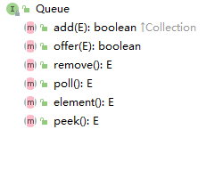

Queue（队列）：一种先进先出（FIFO）的容器，从容器的一端放入对象，从另一端取出对象，并且放入和取出的顺序相同。

JDK 5 添加。（JDK 6 引入 Deque 接口）

主要方法：

- offer
  - （入队）如果可能，将指定的元素插入此队列
- peek()，element()
  - 在不移除的情况下**返回队头**。peek 方法在队列为空时返回 null，element 方法在队列为空时抛出异常。
- poll()，remove()
  - **移除**并返回队头（出队）。poll 方法在队列为空时返回 null，remove 方法在队头为空时抛出异常。