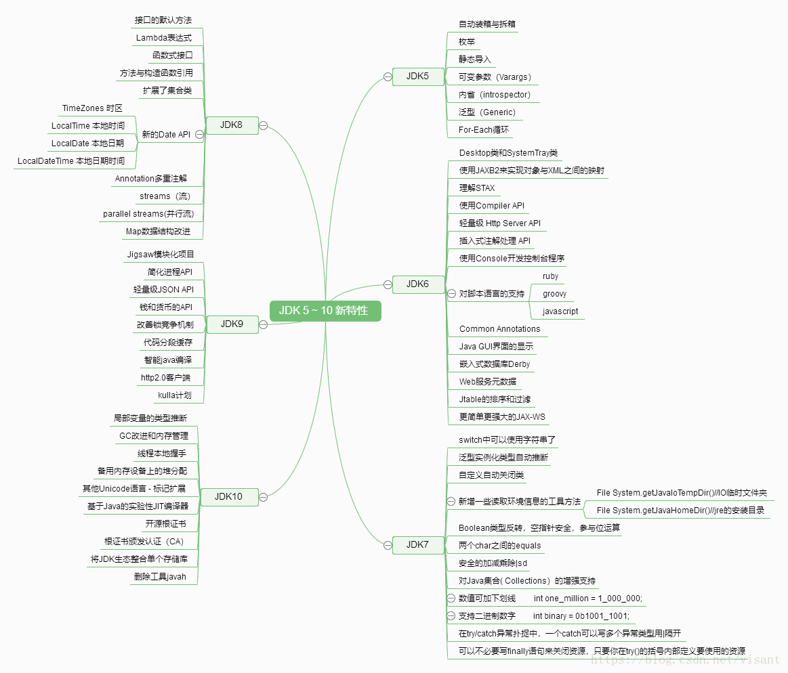

## Java 1.0 - Java 12 的版本时间和代号

| JDK Version | 发布时间   | 代号               | 备注                                                         |
| ----------- | ---------- | ------------------ | ------------------------------------------------------------ |
| 1.0         | 1996-01-23 | Oak(橡树)          | 初代版本，伟大的一个里程碑，但是是纯解释运行，使用外挂JIT，性能比较差，运行速度慢 |
| 1.1         | 1997-02-19 | Sparkler(宝石)     | JDBC、支持内部类、RMI、反射。。。                            |
| 1.2         | 1998-12-08 | Playground(操场)   | 集合框架、JIT。。。                                          |
| 1.3         | 2000-05-08 | Kestrel(红隼)      | 对Java的各个方面都做了大量优化和增强                         |
| 1.4         | 2004-02-06 | Merlin(隼)         | xml处理、支持IPV6、支持正则表达式                            |
| 5           | 2004-09-30 | Tiger(老虎)        | 泛型、增强for、自动拆装箱、可变参数、静态导入、注解          |
| 6           | 2006-12-11 | Mustang(野马)      | 支持脚本语言、JDBC4.0                                        |
| 7           | 2011-07-28 | Dolphin(海豚)      | switc支持String类型、泛型推断、Nio.2开发包、数值类型可以用二进制字符串表示 |
| 8           | 2014-03-18 | Spider(蜘蛛)       | Lambda 表达式、接口默认方法、Stream API 、新的日期API、Nashorn引擎 jjs |
| 9           | 2017-09-22 | Modularity(模块化) | 模块系统、HTTP 2 客户端、多版本兼容 JAR 包、私有接口方法、改进的 Stream API、响应式流（Reactive Streams) API: |
| 10          | 2018-03-21 |                    | var 局部变量类型推断、统一的垃圾回收接口                     |
| 11          | 2018-09-25 |                    | HTTP客户端(标准)、无操作垃圾收集器。首个LTS版本              |
| 12          | 2019-03-19 |                    | 新增一个名为 Shenandoah 的垃圾回收器、扩展switch语句的功能、改进 G1 垃圾回收器 |

