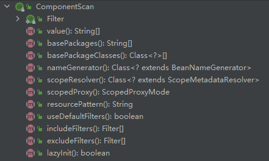

 在实际项目中，我们更多的是使用Spring的包扫描功能对项目中的包进行扫描，凡是在指定的包或其子包中的类上标注了 @Repository、@Service、@Controller、@Component 注解的类都会被扫描到，并将这个类注入到Spring容器中。 

在标注了 @Configuration 注解的 Config 类上使用 @ComponentScan 并指定了扫描的路径之后，输出 Ioc 容器中的 Bean：

```java
@Configuration
@ComponentScan(value = "com.keke")
public class Config {

}
```

输出容器中的 Bean：

```java
@Test
void getAllBeans() {
    AnnotationConfigApplicationContext applicationContext = new AnnotationConfigApplicationContext(Config.class);
    String[] beanDefinitionNames = applicationContext.getBeanDefinitionNames();
    for (String beanDefinitionName : beanDefinitionNames) {
        System.out.println(beanDefinitionName);
    }
}
```

结果会输出标注了以上几个注解的类的名称（首字母小写），比如：

```java
@Controller
public class BookController {
}

@Repository
public class BookDao {
}

@Service
public class BookService {
}

@Component
public class Son {
}

# 输出
config
bookController
bookDao
bookService
son
```

上面输出了配置类是因为 @Configuration 的元注解包含 @Component，所以配置类也是一个组件，也会注入到 Ioc 容器中

```java
@Target(ElementType.TYPE)
@Retention(RetentionPolicy.RUNTIME)
@Documented
@Component
public @interface Configuration {}
```

### 关于 @ComponentScan 注解



```java
@Retention(RetentionPolicy.RUNTIME)
@Target(ElementType.TYPE)
@Documented
@Repeatable(ComponentScans.class)
public @interface ComponentScan {}
```

元注解 @Repeatable 意味着 @ComponentScan 可以再同一个类写多次；或者使用 @ComponentScans

#### useDefaultFilters

使用默认的扫描规则，默认为 true，扫描 value 配置的目录，如果没有 value 扫描根目录。如果我们要自定义 exclude 和 include 规则的话是要关闭的

#### @Filters

过滤规则，有以下几种过滤类型 FilterType

```
FilterType.ANNOTATION：按照注解
FilterType.ASSIGNABLE_TYPE：按照给定的类型；
FilterType.ASPECTJ：使用ASPECTJ表达式
FilterType.REGEX：使用正则指定
FilterType.CUSTOM：使用自定义规则）

classes指定过滤的类
```

#### excludeFilters

指定 Spring 扫描的时候按照什么规则排除哪些组件

- 按指定注解排除

  排除标注了 @Controller、@Service 注解的组件

  ```java
  @Configuration
  @ComponentScan(value = "com.keke", excludeFilters = {
          @ComponentScan.Filter(type = FilterType.ANNOTATION, classes = {Controller.class, Service.class})
  })
  public class Config {}
  ```

- 

#### includeFilters

指定 Spring 扫描的时候按照什么规则只包含哪些组件

- 只包含指定注解的过滤器，需设置 useDefaultFilters = false，否则不生效

  ```java
  @Configuration
  @ComponentScan(value = "com.keke", includeFilters = {
          @ComponentScan.Filter(type = FilterType.ANNOTATION, classes = Service.class)
  }, useDefaultFilters = false)
  public class Config {}
  ```

  