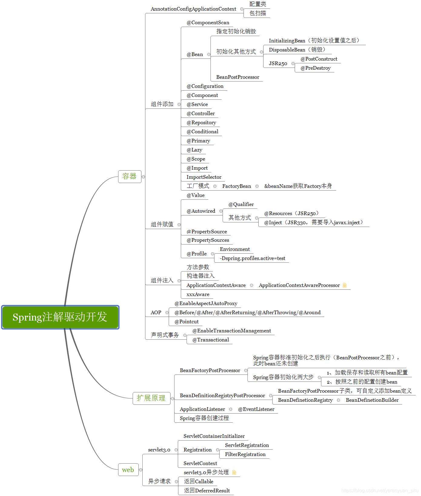
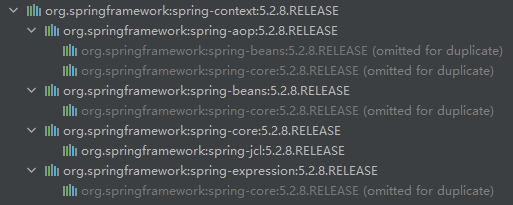

### 目录

- **容器**
  - AnnotationConfigApplicationContext
  - 组件添加
  - 组件赋值
  - 组件注入
  - AOP
  - 声明式事务
- **拓展原理**
  - BeanFactoryPostProcessor
  - BeanDefinitionRegistryPostProcessor
  - ApplicationListener
  - Spring 容器创建过程
- **web**
  - servlet 3.0
  - 异步请求

[Spring Annotation 代码库]()

默认引入 `spring-context` 依赖即可，maven 会自动引入相关依赖

