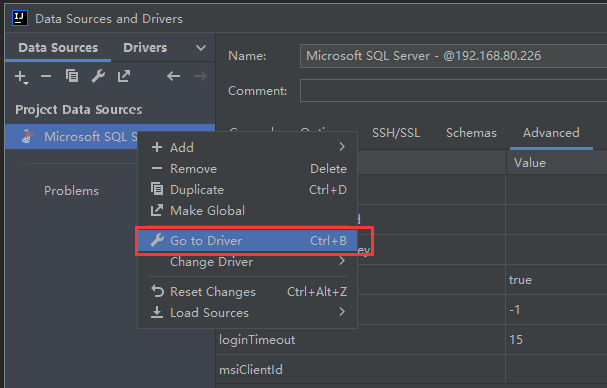
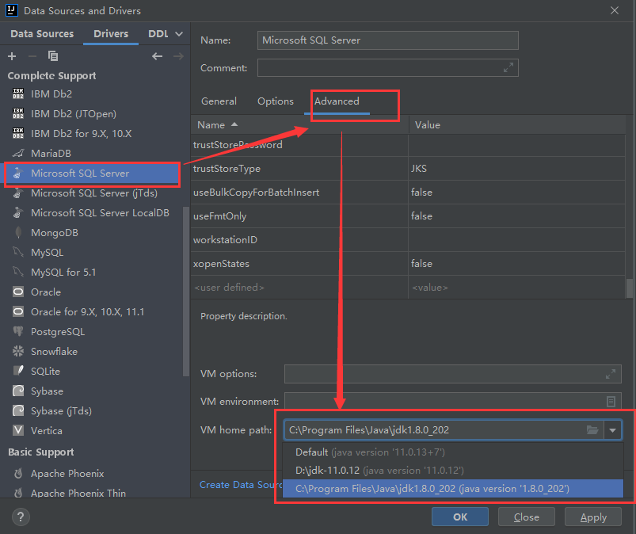

最近新开项目，用 Idea 的 DataSource 连接 SqlServer 时提示报错：

```
The server selected protocol version TLS10 is not accepted by client preferences [TLS12]
```

百度说是客户端的 TLS 版本和服务器的 TLS 版本不一致导致，仔细查看项目配置，发现是 Project SDK 选择了 java 11，修改连接的 VM 配置即可：



这里选择 jdk 1.8 之后再连接即可成功

