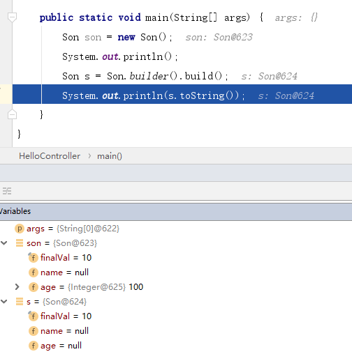

Lombok 是一个可以通过简单的注解形式来帮助我们简化消除一些必须有但显得很臃肿的 Java 代码的工具，通过使用对应的注解，可以在编译源码的时候生成对应的方法。

- 官网地址：https://projectlombok.org/
- GitHub：https://github.com/rzwitserloot/lombok

## IDEA 安装 Lombok 插件

IDEA 中依次点击 `File` --> `Settings` --> `Plugins` 搜索 Lombok 安装即可


## 查看是否安装成功


## 使用 Lombok

### POM

`pom.xml` 中增加所需依赖，坐标如下：

```text
<dependency>
    <groupId>org.projectlombok</groupId>
    <artifactId>lombok</artifactId>
    <version>1.16.18</version>
</dependency>
```

### 使用 `@Data` 注解简化 POJO

`@Data` 包含了 `@ToString`，`@EqualsAndHashCode`，`@Getter/@Setter` 和 `@RequiredArgsConstructor`的功能

其他相关注解请自行查阅：http://jnb.ociweb.com/jnb/jnbJan2010.html

### 使用案例

```text
@Data
public class ItemCatNode implements Serializable {
    @JsonProperty(value = "u")
    private String url;
    @JsonProperty(value = "n")
    private String name;
    @JsonProperty(value = "i")
    private List<?> item;
}
```


### @NoArgsConstructor/@RequiredArgsConstructor/@AllArgsConstructor

第一个和第三个为该类产生无参的构造方法和包含所有参数的构造方法，第二个注解则使用类中所有带有@NonNull注解的或者带有final修饰的成员变量生成对应的构造方法，成员变量都是非静态的。另外，如果类中含有final修饰的成员变量，是无法使用@NoArgsConstructor注解的。

```java
@AllArgsConstructor
public class Son {

    private String name;
    private Integer age;
}
@AllArgsConstructor
class Parent {
    private Integer id;
}
------------------编译后的两个class文件---------------------
public class Son {
    private String name;
    private Integer age;

    public Son(final String name, final Integer age) {
        this.name = name;
        this.age = age;
    }
}

class Parent {
    private Integer id;

    public Parent(final Integer id) {
        this.id = id;
    }
}
// 只有一个全参构造器，没有默认的构造器了
```

```java
@AllArgsConstructor(access = AccessLevel.PROTECTED, staticName = "getOne")
public class Son {
    private final int finalVal = 10;
    private String name;
    private Integer age;
}
--------------------编译后-------------------
public class Son {
    private final int finalVal = 10;
    private String name;
    private Integer age;

    private Son(final String name, final Integer age) {
        this.name = name;
        this.age = age;
    }

    protected static Son getOne(final String name, final Integer age) {
        return new Son(name, age);
    }
}
// 可以指定生成构造器的访问权限。
// 注意：如果这里指定了一个静态方法，那么构造器会变为private，只能通过静态方法对外提供访问，并且final的属性值，是不会被放进构造函数里的。
```

@NoArgsConstructor 的使用方式同上。@RequiredArgsConstructor：

```java
@RequiredArgsConstructor
public class Son {
    private final int finalVal = 10;
    @NonNull
    private String name;
    @NonNull
    private Integer age;
}
-------------------编译后------------------
public class Son {
    private final int finalVal = 10;
    @NonNull
    private String name;
    @NonNull
    private Integer age;

    public Son(@NonNull final String name, @NonNull final Integer age) {
        if (name == null) {
            throw new NullPointerException("name is marked @NonNull but is null");
        } else if (age == null) {
            throw new NullPointerException("age is marked @NonNull but is null");
        } else {
            this.name = name;
            this.age = age;
        }
    }
}
// 该注解会识别带有@NonNull注解的字段。然后以这些字段为元素产生一个构造函数。
// 如果没有字段带有@NonNull注解，那效果等同于@NoArgsConstructor
```

### @Builder

提供了一种比较推荐的构建值对象的方式。缺点是父类的属性不能产生

```java
@Builder
public class Son {
    private final int finalVal = 10;
    private String name;
    private Integer age;
}
---------------编译后---------------
public class Son {
    private final int finalVal = 10;
    private String name;
    private Integer age;

    Son(final String name, final Integer age) {
        this.name = name;
        this.age = age;
    }

    public static com.seven.demo.entiry.Son.SonBuilder builder() {
        return new com.seven.demo.entiry.Son.SonBuilder();
    }
}
// 因此，我们构建一个对象就可以以这种方式：
Son son = Son.builder().name("jack").age(10).build();
```

### @Cleanup 能够自动释放资源

这个注解用在变量前面，可以保证此变量代表的资源会被自动关闭，**默认是调用资源的close()方法**。

```
public @interface Cleanup {
    String value() default "close";
}
```

如果该资源有其他关闭方法，可以使用@Cleanup("methodName") 来指定要调用的方法。

```java
public static void main(String[] args) throws Exception {
    @Cleanup InputStream in = new FileInputStream(args[0]);
    @Cleanup OutputStream out = new FileOutputStream(args[1]);
    byte[] b = new byte[1024];
    while (true) {
        int r = in.read();
        if (r == -1) break;
        out.write(b, 0, r);
    }
}
-------------------编译后-------------------
public static void main(String[] args) throws Exception {
    FileInputStream in = new FileInputStream(args[0]);

    try {
        FileOutputStream out = new FileOutputStream(args[1]);

        try {
            byte[] b = new byte[1024];

            while(true) {
                int r = in.read();
                if (r == -1) {
                    return;
                }

                out.write(b, 0, r);
            }
        } finally {
            if (Collections.singletonList(out).get(0) != null) {
                out.close();
            }

        }
    } finally {
        if (Collections.singletonList(in).get(0) != null) {
            in.close();
        }

    }
}
// 就这么一个简单的注解，就实现了关流操作
```

### @Data 强悍的组合功能包

相当于注解集合。效果等同于 @Getter+@Setter+@ToString+@EqualsAndHashCode+@RequiredArgsContructor。注意：不包括@NoArgsConstructor和@AllArgsConstructor

### @Value

@Value 注解和 @Data 注解类似，区别在于它会把所有成员变量默认定义为 private final 修饰，并且不会生成 set 方法。所以 @Value 更适合只读性更强的类，所以特殊情况下，还是可以使用的。

### @ToString/@EqualsAndHashCode

生成 toString，equals 和 hashcode 方法，同时后者还会生成一个 canEquals 方法，用于判断某个对象是否是当前类的实例。生成方法时，只会使用类中的非静态成员变量。

有些关键属性，可以控制 toString 的输出：

```java
@ToString(includeFieldNames = true,	// 是否使用字段名
exclude = {"name"},	// 排除某些字段
of = {"age"},	// 只使用某些字段
callSuper = true)	// 是否让父类字段也参与，默认 false
// 大多数情况下，使用默认的即可
```

### @Getter/@Setter

用在成员变量或者类上面，为成员变量生成对应的get和set方法，同时还可以为生成的方法指定访问修饰符，默认为 public。

直接用在类上，可以为此类里的所有非静态成员变量生成对应的 get 和 set 方法。如果是 final 变量，那就只会有 get 方法。

```java
@Getter
@Setter
public class Son {
    private final int finalVal = 10;
    private String name;
    private Integer age;
}
---------------------编译后-------------------
public class Son {
    private final int finalVal = 10;
    private String name;
    private Integer age;

    public Son() {
    }

    public int getFinalVal() {
        this.getClass();
        return 10;
    }

    public String getName() {
        return this.name;
    }

    public Integer getAge() {
        return this.age;
    }

    public void setName(final String name) {
        this.name = name;
    }

    public void setAge(final Integer age) {
        this.age = age;
    }
}
```

### @NonNull

这个注解可以用在成员方法或者构造方法的参数前面，会自动产生一个关于此参数的非空检查，如果参数为空，则抛出一个空指针异常。

```java
public String getName(@NonNull Son son) {
    return son.getName();
}
---------------------编译后--------------------
public String getName(@NonNull Son son) {
    if (son == null) {
        throw new NullPointerException("son is marked @NonNull but is null");
    } else {
        return son.getName();
    }
}
```

### @Log、CommonsLog、Slf4j、XSlf4j、Log4j、Log4j2等日志注解

```java
@CommonsLog
private static final org.apache.commons.logging.Log log = org.apache.commons.logging.LogFactory.getLog(LogExample.class);
@JBossLog
private static final org.jboss.logging.Logger log = org.jboss.logging.Logger.getLogger(LogExample.class);
@Log
private static final java.util.logging.Logger log = java.util.logging.Logger.getLogger(LogExample.class.getName());
@Log4j
private static final org.apache.log4j.Logger log = org.apache.log4j.Logger.getLogger(LogExample.class);
@Log4j2
private static final org.apache.logging.log4j.Logger log = org.apache.logging.log4j.LogManager.getLogger(LogExample.class);
@Slf4j
private static final org.slf4j.Logger log = org.slf4j.LoggerFactory.getLogger(LogExample.class);
@XSlf4j
private static final org.slf4j.ext.XLogger log = org.slf4j.ext.XLoggerFactory.getXLogger(LogExample.class);
```

### @Builder 和 @NoArgsConstructor 一起使用冲突问题

```java
// 当这样使用时，编译报错
@Builder
@NoArgsConstructor
public class Son {
    private final int finalVal = 10;
    private String name;
    private Integer age;
}
// 原因很简单，@Builder 会自动构建全参构造器。而添加上 @NoArgsConstructor 后就不会自动产生全参构造器
// 两种解决方式：
// 1、去掉 @NoArgsConstructor
// 2、添加 @AllArgsConstructor （推荐，毕竟无参构造最好要有）
```

### @Builder 注解影响设置默认值问题

```java
@Builder
@NoArgsConstructor
@AllArgsConstructor
public class Son {
    private final int finalVal = 10;
    private String name;
    private Integer age = 100;
}
// 下图发现，new 出来的对象默认值没有问题，但是 builder 构建出来的对象，默认值却没有设置进去
```



#### 解决方案：

```java
@Builder
@NoArgsConstructor
@AllArgsConstructor
public class Son {
    private final int finalVal = 10;
    private String name;
    @Builder.Default
    private Integer age = 100;
}
```

