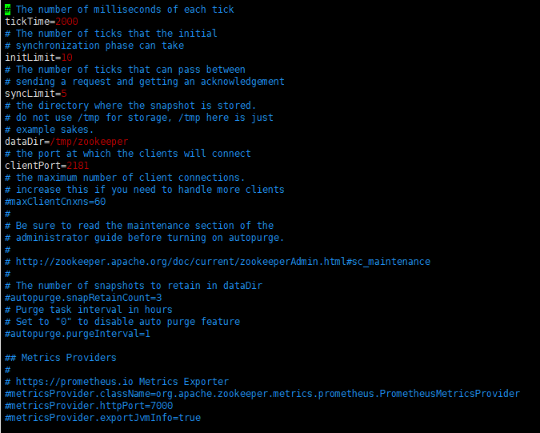

## 概述

分布式协调框架 Zookeeper

[官方网站](https://zookeeper.apache.org/)

## 安装

zk 依赖 java 环境，所以首先要在目标机器上安装好 jdk


### 单机模式

1. 首先下载好安装包：

https://zookeeper.apache.org/releases.html

2. 上传到服务器 `/usr/local/software` 下，并解压

   ```
   tar -zxvf apache-zookeeper-3.7.0-bin.tar.gz
   mv apache-zookeeper-3.7.0-bin/ zookeeper
   ```

3. 目录结构为：


bin 目录下为可执行脚本

conf 目录下为配置文件

4. 修改配置，拷贝 conf 目录下 zoo_sample.cfg 为 zoo.cfg

   ```
   cp zoo_sample.cfg zoo.cfg
   vi zoo.cfg
   ```

   

修改配置项：dataDir，数据存储目录，首先创建一个目录，再设置

```
cd /var
mkdir zookeeper
# 然后修改 dataDir 为 /var/zookeeper
```

5. 启动 zk

   ```
   cd /usr/local/software/zookeeper
   bin/zkServer.sh start
   ```

   

   ```
   # 使用下面命令可以看到启动的java进程中包含 zk
   jps -l
   ```

   

6. 客户端启动

   ```
   bin/zkCli.sh
   # 启动之后进入zk控制台，可以使用zk的命令进行查看节点树之类的操作 ls
   
   # 退出客户端
   quit
   ```

   

7. 查看 zk server 状态

   ```
   bin/zkServer.sh status
   ```

   

8. 停止 zk server

   ```
   bin/zkServer.sh stop
   ```

### 集群模式

1. 三个节点分别按单机模式部署

2. 分别配置服务器编号，在数据目录 `/var/zookeeper` 下创建一个 myid 的文件

   ```
   vi myid
   # 在文件中添加与 server 对应的编号：1、2、3...
   ```

3. 配置 zoo.cfg 文件

   ```
   # 在每个节点都增加如下配置，如在 myid 为1 的节点上增加
   server.A=B:C:D
   A表示myid中的数字，B为服务器地址，C、D为主从交互固定端口号
   
   server.1=xxxx:2888:3888
   server.2=xxxx:2888:3888
   server.3=xxxx:2888:3888
   ```

4. 查看集群节点状态

   ```
   bin/zkServer.sh status
   ```

   

   

## 配置参数解读

zk 中的配置文件 zoo.cfg 中参数含义解读如下：

1. tickTime=2000：通信心跳数，zk 服务端与客户端的心跳时间间隔，单位毫秒

2. initLimit=10：leader与flower初始通信时能容忍的最多心跳数（tickTime 的数量）

3. syncLimit=5：leader 与 flower同步通信次数限制，leader与flower之间通信时间如果超过 syncLimit*tickTime，leader认为flower挂掉，从服务器列表中删除 follower

4. dataDir：zk 的数据保存目录
5. clientPort=2181：服务启动端口